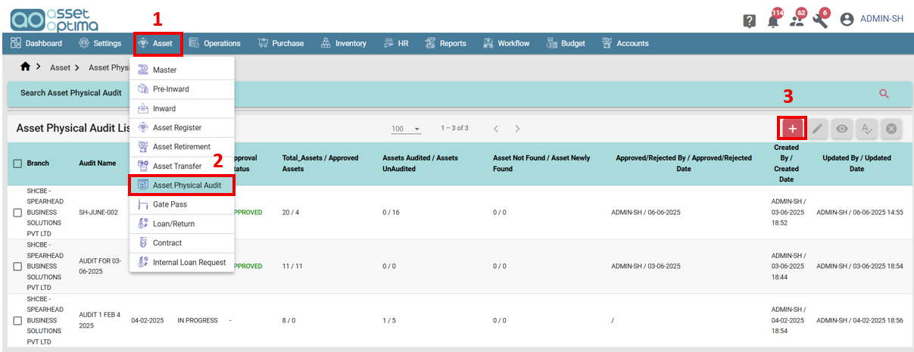
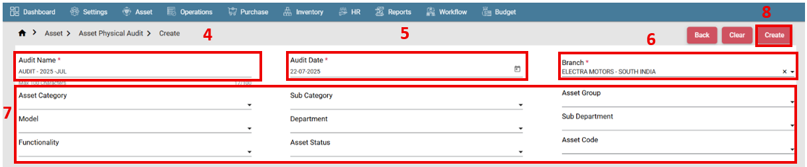
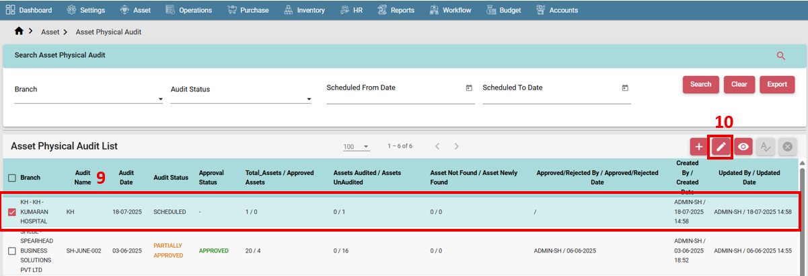
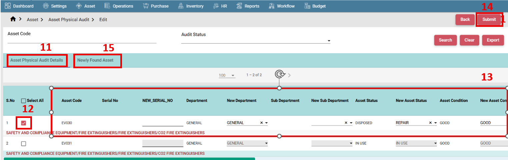
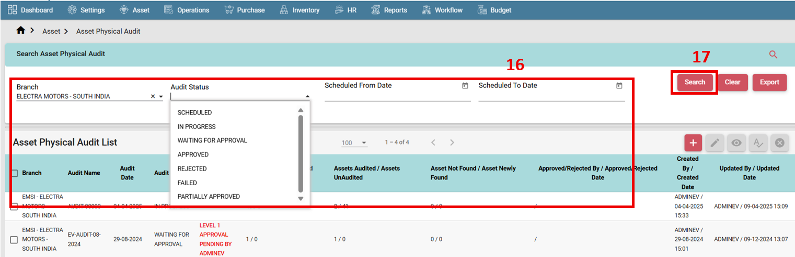
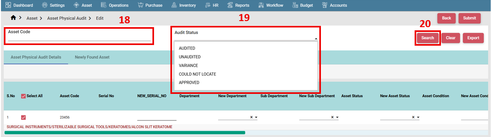
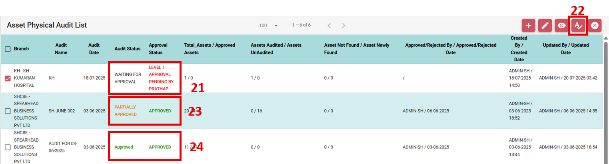
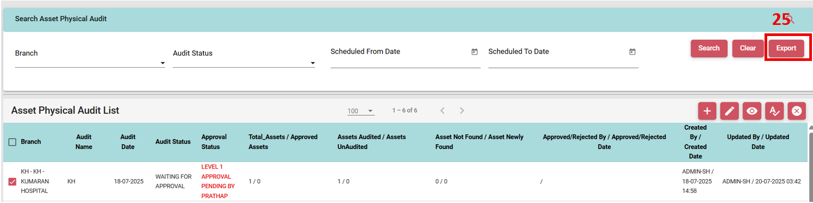
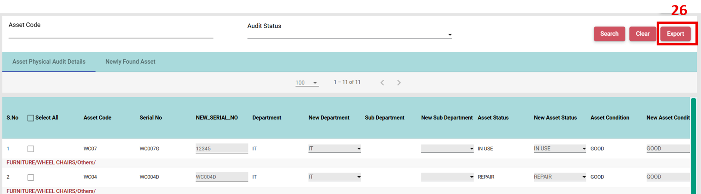
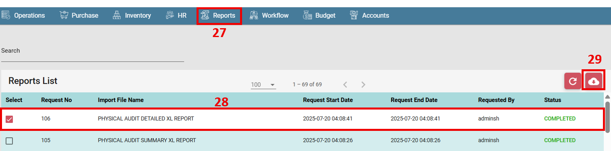

# ASSET PHYSICAL AUDIT 

#### How to create a Physical Audit record?

- Go to asset Main menu. (1)
- Select Asset Physical Audit. (2)
- Click create button. (3)

 

- Provide Audit Name. (4)
- Select Audit date. (5)
- Select Branch. (6)
- Search Asset with any of the criteria. (7)
- Click on create. (8)

  

- Physical Audit record is created.
- Go to list screen.
- Select the record. (9)
- Click on edit. (10)

  

- Go to Asset physical Audit Details tab. (11)
- Select the record. (12)
- Edit the required data. (13)
- Click on submit. (14)
- Newly found assets will be shown in Newly found Asset tab. (15)

  

#### How to search a Physical Audit record?

- Go to list screen.
- Expand search tab.
- Provide search criteria. (16)
- Click on search button. (17)

  

- For particular asset search, select and open the record in edit mode.
- Search by Asset code (18) or Audit status. (19)
- Click on search button. (20)

  

#### How to approve a Physical Audit record?

- Go to List screen.
- Select Asset in Waiting for Approval Status. (21)
- Click on Approval icon. (22)
- If there are still asset pending for Audit, record will be partially approved. (23)
- If all assets are audited and approved record will be approved completely. (24)

 
 
#### How to export a Physical Audit record?

- Go to list screen.
- Search the asset if required or clear all criteria.
- Click on export button. (25) 

 
 
- For detailed report, open the record in edit mode.
- Provide search criteria if required.
- Click on export button. (26)
- Report request will be created.
 
  

- Got to reports module. (27)
- Select record. (28)
- Download required report. (29)

  

