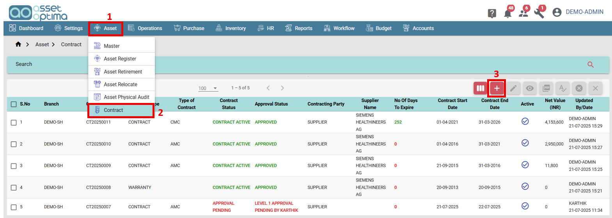
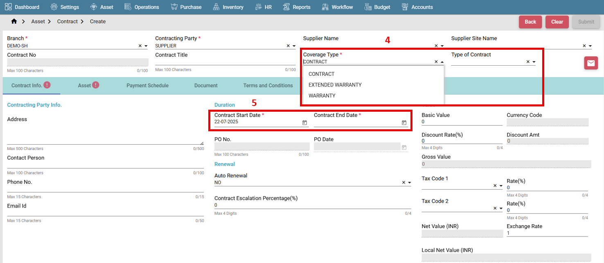
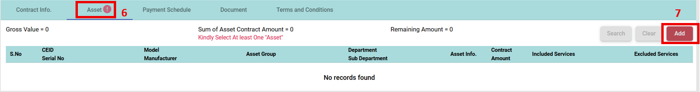
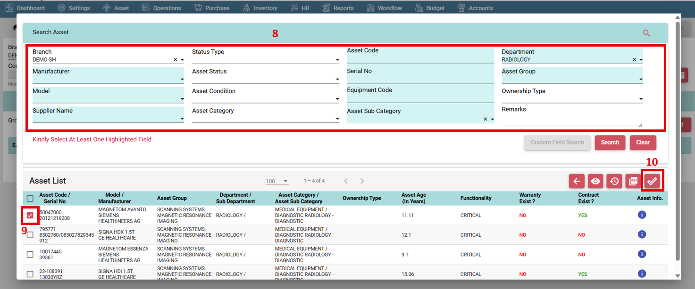
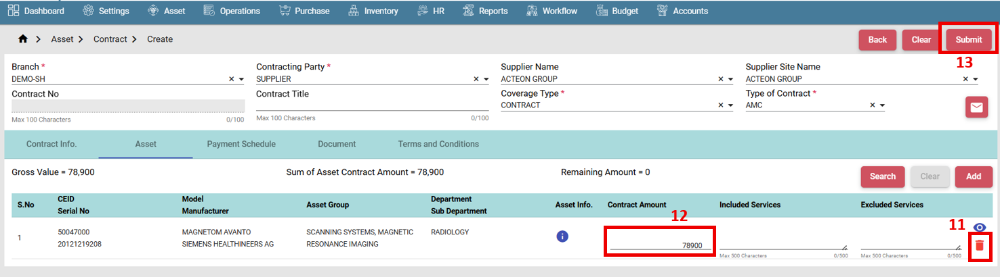
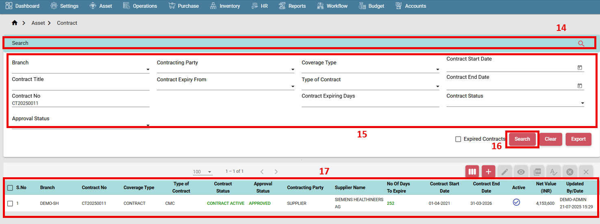
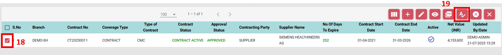
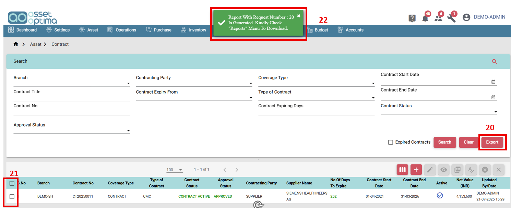
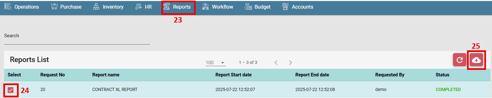

# ASSET CONTRACT 

#### How to create a Contract?

- Go to Asset Main Menu. (1)
- Select Asset Contract. (2)
- Click on create button. (3)

 

- Select Coverage type and type of contract. (4)
- Contract Type and value is not applicable if coverage type is Warranty.
- Choose Start date and End date. (5)

 

- Go to Asset Tab. (6)
- Click on Add button. (7)

 

- Search asset by any criteria. (8)
- Select asset single or multiple assets. (9)
- Click on submit. (10)

 

- Delete asset if not required. (11)
- Provide contract value. (12)
- Click on submit button. (13)
- Approve the contract.
- Upon final approval, it will automatically convert to PO.

 

#### How to search a Contract?

- Go to list screen.
- Expand the search tab. (14)
- Provide criteria to filter data. (15)
- Click on search button. (16)
- Records will be displayed accordingly. (17)

 

#### How to approve a Contract?

- Go to list screen.
- Search the assets to be approved.
- Select single asset or multiple assets. (18)
- Click on Approve button. (19)

 

#### How to export a report?

- Go to list screen. 
- Use search filter for specific data.
- Provide or clear all search filters for complete data. (20)
- Click on the export button. (21)
- Report will be exported. (22)

 

- Go to Reports module. (23)
- Select the record.(24)
- Download the report. (25)

 