# ASSET REGISTER {docsify-ignore}
 
#### How to register an Asset??
 
- Go to Asset Main menu. (1)
- Select Asset Register module. (2)
- Click on create button. (3)

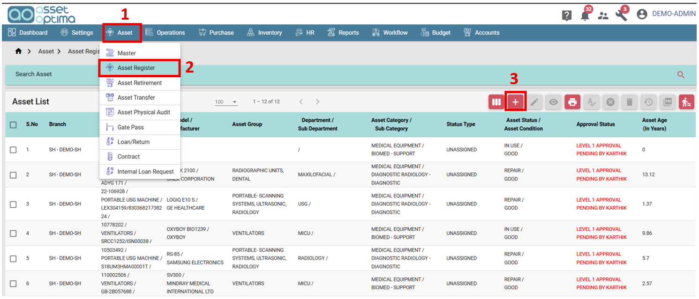

- Select branch. (4)
- Choose category and sub category. (5)
- Provide asset name. (6)
- Enter asset code. (7)
- Choose asset status. (8)
- Upload asset image if available. (9)
- Provide additional info if any. (10)
- All other data will be auto-filled once Model is selected.
- Enter allotted info details if available. (11)
- Employee details will be auto filled once Person In-charge is selected. 

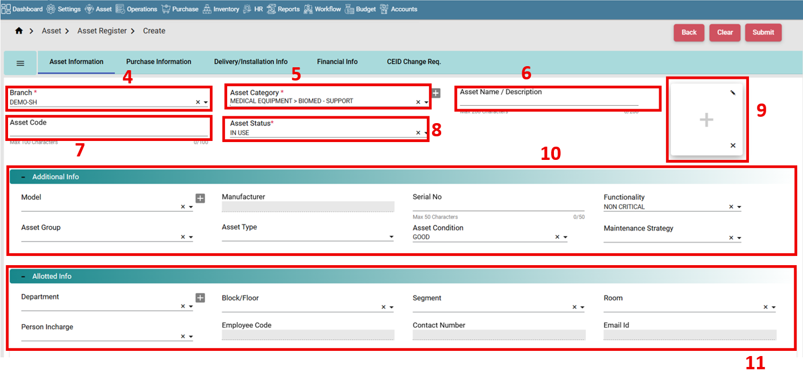

- Go to Purchase Information tab. (12)
- Provide supplier and service provider data if any. (13)
- Enter the purchase details and upload the PO copy if available. (14)
- Enter the ownership details. (15)
- If ownership type is selected as Self not additional data required. (16)

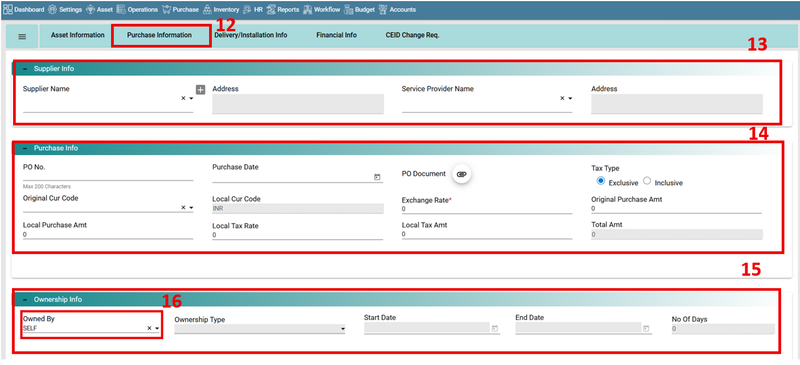

- If Ownership type is selected as Business partner, provide the business partner data. (17)
- Click on the add icon. (18)

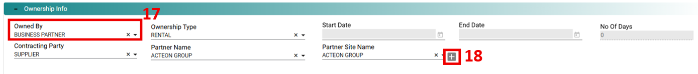

- Provide contract info (Rental/Lease/Loan) if available. (19)

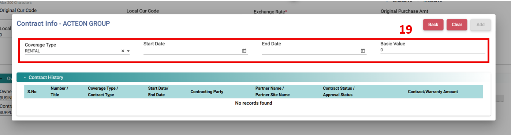

- Go to Delivery/Installation info tab. (20)
- Provide Delivery details and Invoice details if any. (21)
- Provide Installation details and Invoice details if any. (22)

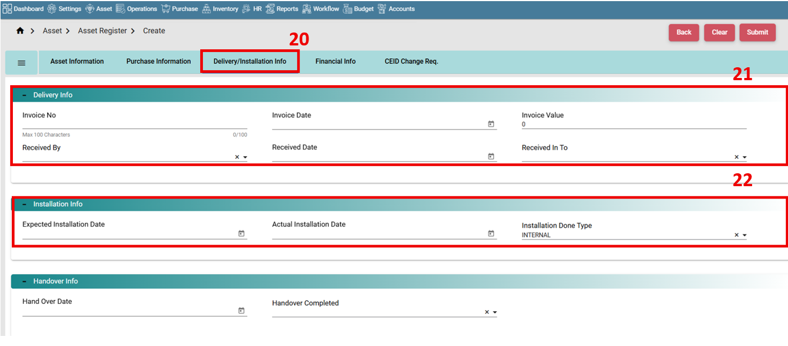

- Go to financial info tab. (23)
- Enter EOL and Depreciation details if available. (24)
- Expected EOL Date will be calculated Expected Life in Years and vice versa.
- Select Depreciation Method.
- Asset age will be calculated based on Age Criteria
- Provide Income Tax Depreciation.
- Scrap Value will be calculated from Scrap Value in % or vice versa.
- Submit the record. (25)

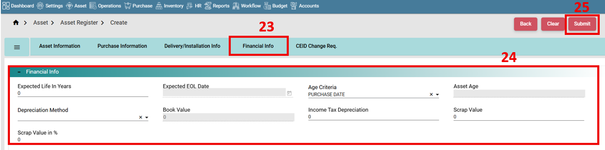

#### How to search assets?

- Go to list screen.
- Expand the search tab. (26)
- Provide data in the search fields. 
- For more precise and detailed filtering, use Advanced Search option. (27)
- Click on search button. (28)
- Based on search filters data will be listed below. (29)

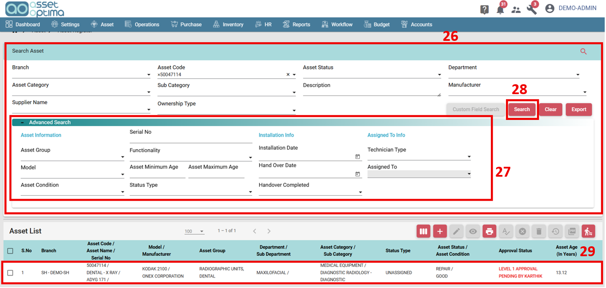

#### How to approve assets?
 
- For Bulk approval go to asset list screen. 
- Select the assets. (30)
- To approve any particular set of data you can apply the filter in search tab. (31) 
- Click on Approve Button. (32)

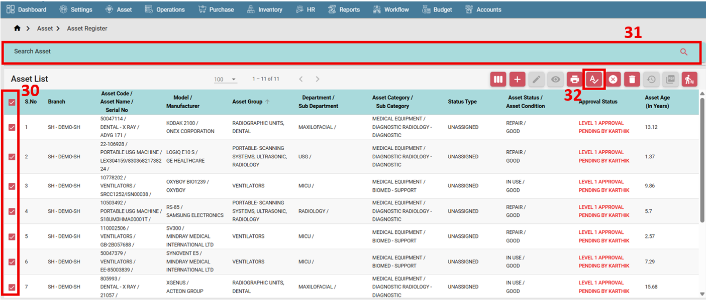

- To approve a single asset, select and open the asset in edit mode.
- Go to workflow approval tab. (33)
- Approval workflow will be shown. (34)
- Click on Approve button. (35)
  
#### How to export a report?

- Go to list screen. 
- Use search filter for specific data (36)
- Or clear all search filters for complete data. (37)
- Click on the export button. (38)
- Report will be exported. (39)

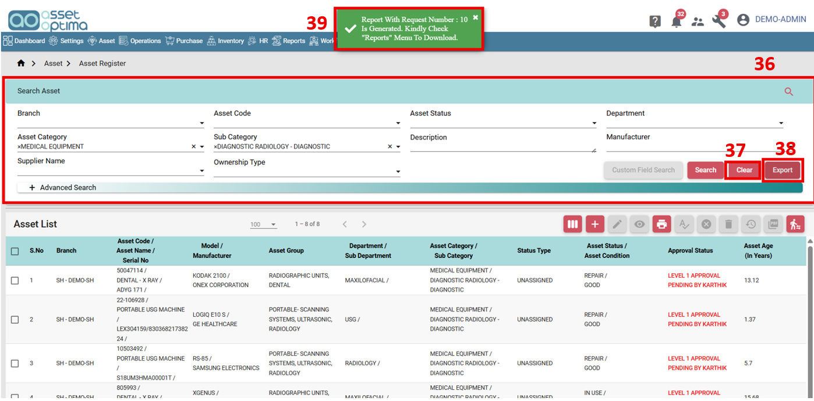

- Go to Reports module. (40)
- Select the record.(41)
- Download the report. (42)

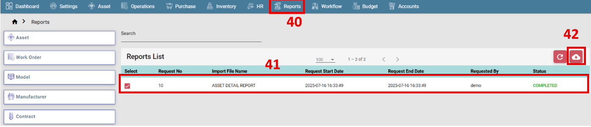