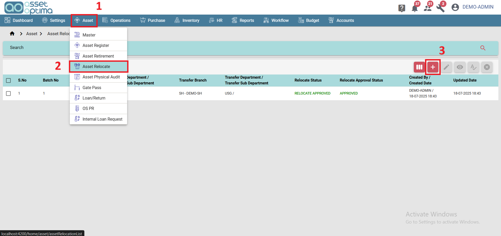
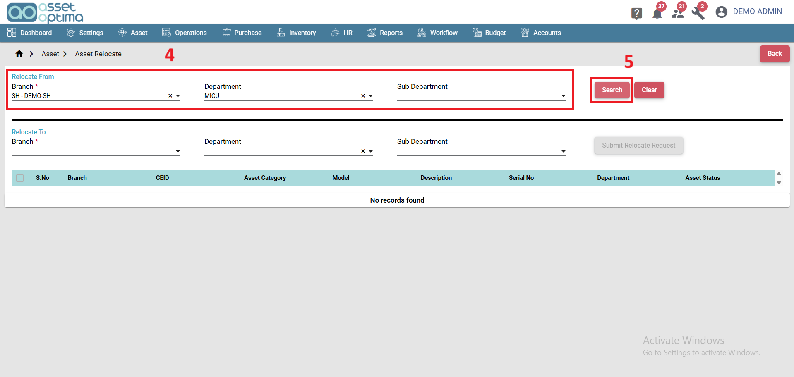
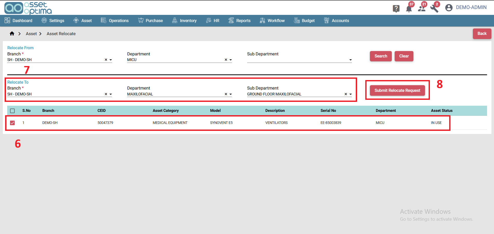
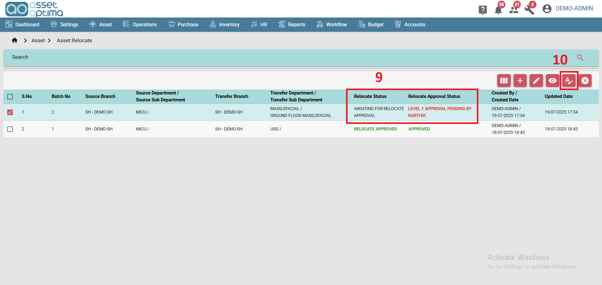
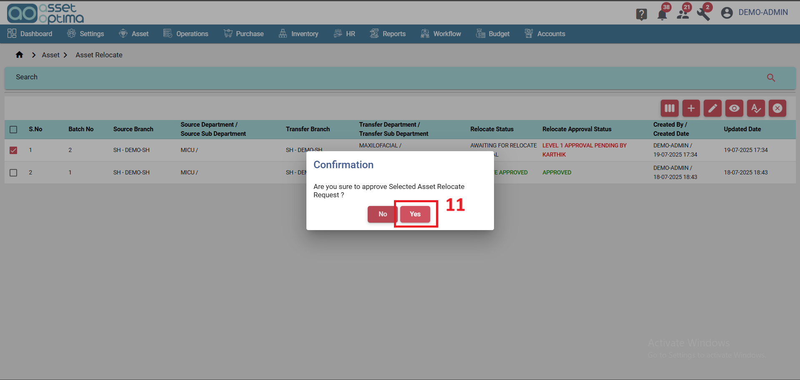
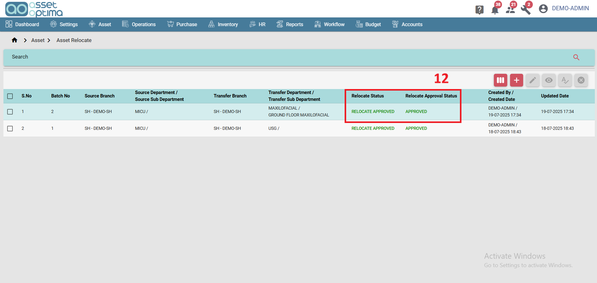

# ASSET TRANSFER/RELOCATE 
 
#### How to transfer/relocate an Asset?
 
- Navigate to Asset main menu. (1)
- Select Asset Relocate. (2)
- Click on Create button. (3)

- Choose relocate from Branch, Department, and Sub-department. (4)
- Click on Search button. (5)

- Select assets to relocate. (6)
- Choose relocate to Branch, Department, and Sub-department. (7)
- Click on Submit button. (8)

- Relocate request will be raised. (9)
    - Relocation Status: Awaiting for Relocate Approval
    - Relocation Approval Status: As per your workflow naming definition.
- Approve the request. (10)

- In confirmation pop-up click Yes to proceed with approval. (11)

- Once approved by all workflow levels, (12)
    - Relocation Status: Approved
    - Relocation Approval Status: Approved

