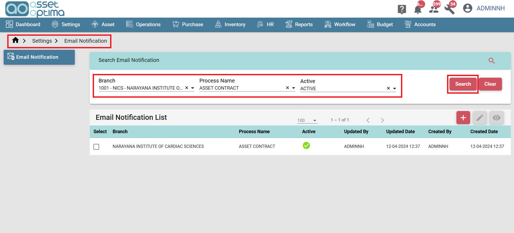
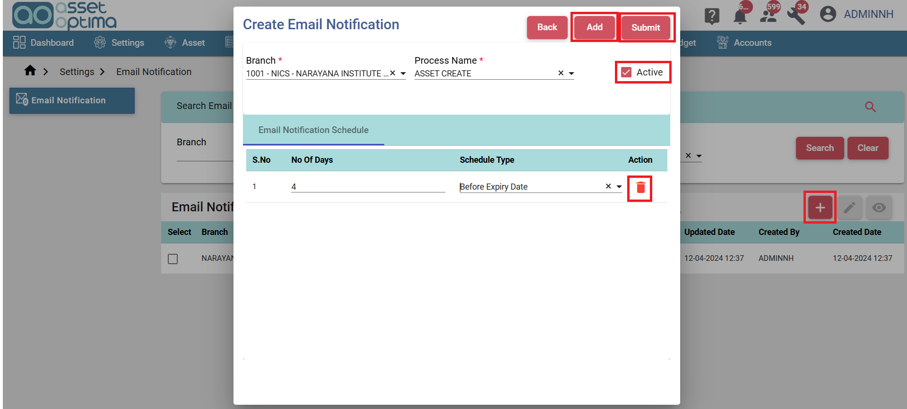
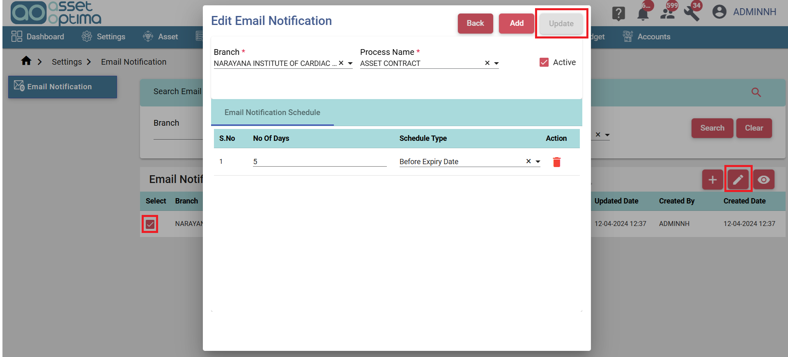

> The Email Notification module allows users to set up scheduled email alerts for various branches across different modules. Users can define the notification timing by specifying the number of days and selecting a schedule type—either "Before Expiry Date" or "After Expiry Date." Multiple schedules can be created per module, allowing flexibility in how notifications are timed. This helps ensure timely reminders for upcoming or overdue events and tasks.

- Email Notification List:
  - In the list screen user can search Email Notification List by Branch, Process Name and Active or Inactive status.
  - Select the Branch, Process Name and Status form the dropdown and click the Search button to get the data.
  - By default all records will be listed in the list screen.

- Email Notification Create:
   - To add the Email Notification, click the "Create" button, complete the relevant fields and click the Submit button to save the record.

- Email Notification Edit:
  - To edit the Email Notification, select the corresponding checkbox and click the edit button to edit.
  - Click the update to save the changes.
  - Click the view button to see the record info.

