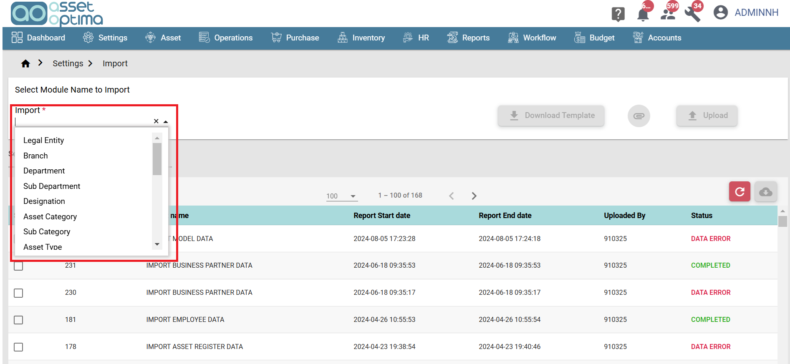
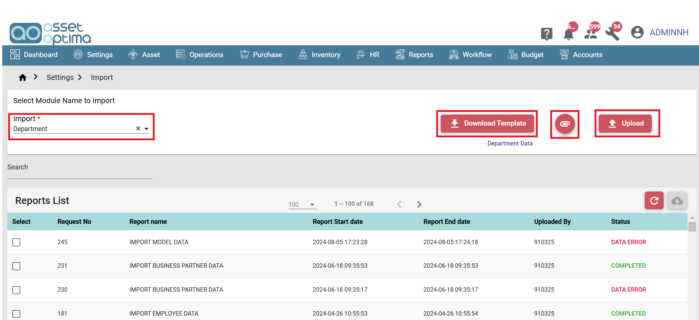
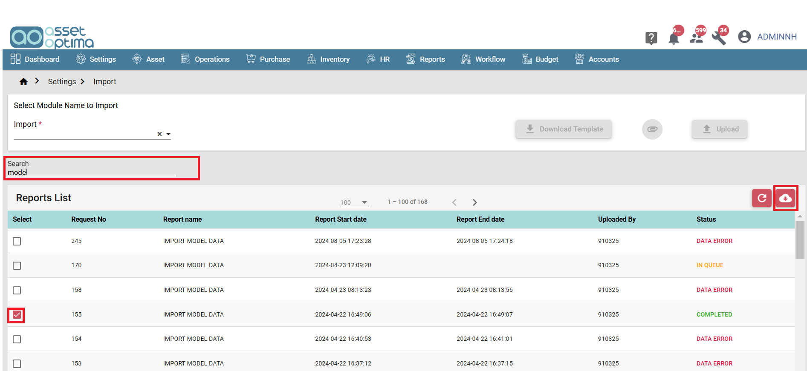

> The Import Module in the application enables users to upload bulk data, streamlining the data entry process by allowing large datasets to be added efficiently at once.

- Import Create:
    - The Import Module allows users to upload bulk data for different modules via an Excel file. 
    - From the import dropdown, users can select the desired module and download the corresponding Excel template. 
    - In the import dropdown modules will be displayed in a specific order, only this order the data should be imported.
    - In the downloaded template instructions will be given, based on the example data and instruction fill the excel sheet.
    - The template should be filled with the actual data to be imported. 
    - Once the data is populated, users can upload the file and import the information by clicking the Upload button.
    - This streamlines the process of adding large volumes of data to the system efficiently.

- Import List:
  - In the Import List screen, use the Search field to find the desired report by name. 
  - Select the report by checking the checkbox, then click the Download icon to download the report as an Excel file..

