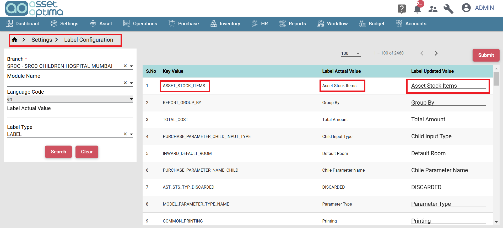

>- The Label Configuration Module allows you to customize and manage the labels used across your application. 
>- This module provides an easy interface to update and display label names based on the requirements of different branches or organizations. 
>- The primary use of this module is to allow for the modification of label values, ensuring that the application’s terminology aligns with the preferences of different users or regions.

### Key-Value Pair Display

- In this module, each label is displayed as a key-value pair. The key represents the unique identifier for the label, while the value is the actual label text displayed on the user interface (UI).
- For example, a label with the key "customer_name" might have a value of "Customer Name" as its default label.

### Update Label Values

- You can modify the value of any label based on your organization’s or branch’s requirements.
- Once updated, the new label values are applied immediately across the system and will be reflected in all relevant screens where that label appears.

