# MASTER {docsify-ignore}

### Asset

> An Asset refers to any valuable item owned by an organization that is used in operations. Assets can range from physical items like equipment, furniture, and vehicles to intangible assets like software licenses. 

### Asset Category

> The Asset Category feature is designed to help users classify and organize assets based on their type and purpose. By categorizing assets effectively, users can easily manage and track different types of assets within the system.

- Asset Category is important for creating an asset.
- In this system asset can categorized based on it's category.
- Search a Asset Category in the search field, result will be displayed in the list.

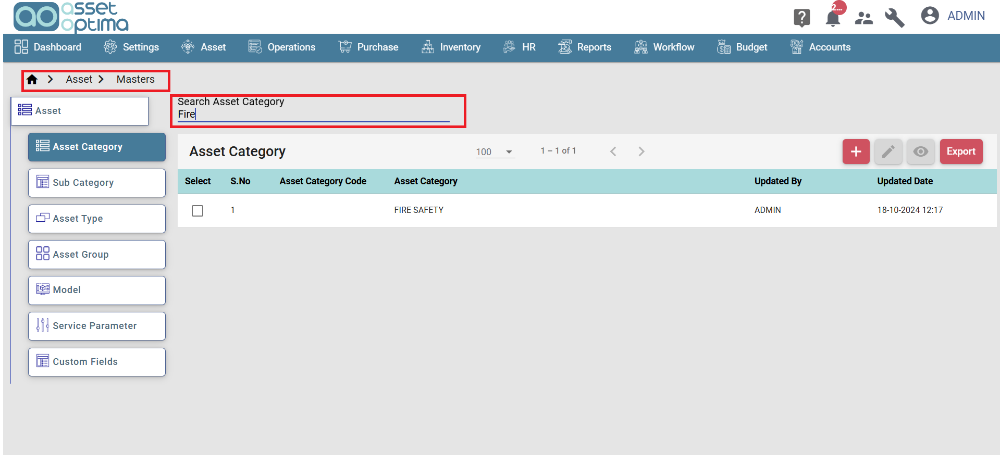

- Click the "Create" button to create Asset Category and fill in all the required details marked as important. 
- Click the checkbox of the tabs that you want do display in the Model screen.
- Click the submit to create the Asset Category.

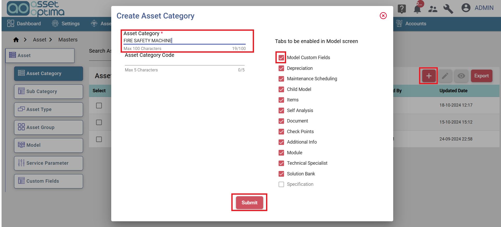

- To edit a Asset Category record click the check box and click the edit button to edit the record.
- Fill in all the required details marked as important and click update button.

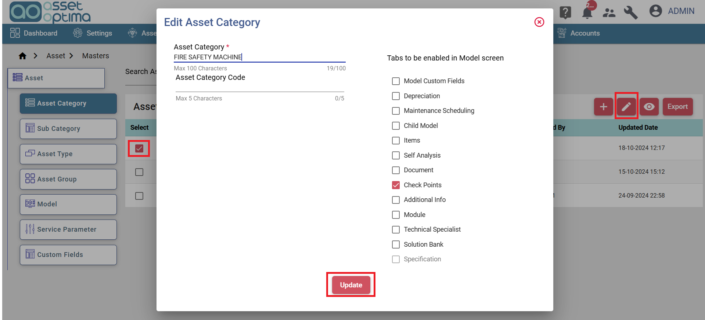

### Sub Category

> The Asset Sub Category feature allows users to add further classifications within each main asset category, providing a detailed structure for asset management. Sub-categories enable more specific grouping, which helps in organizing assets based on finer distinctions. For example, under the IT Equipment category, sub-categories like Laptops, Desktops, and Printers can be created.

- Asset Sub Category is important for creating an asset.
- In this system asset can categorized based on it's category and Sub Category.
- Select the Asset Category and Sub Category, Based on the selected category the sub category data will be loaded.
- Click the "Search" button.

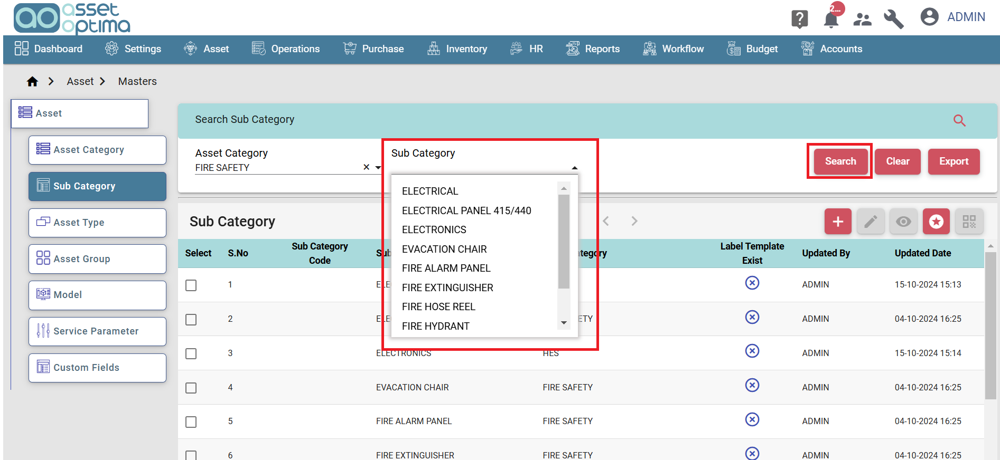

- Click the "Create" button to create Asset Sub Category and fill in all the required details marked as important. 
- Click the submit to create the Asset Category.

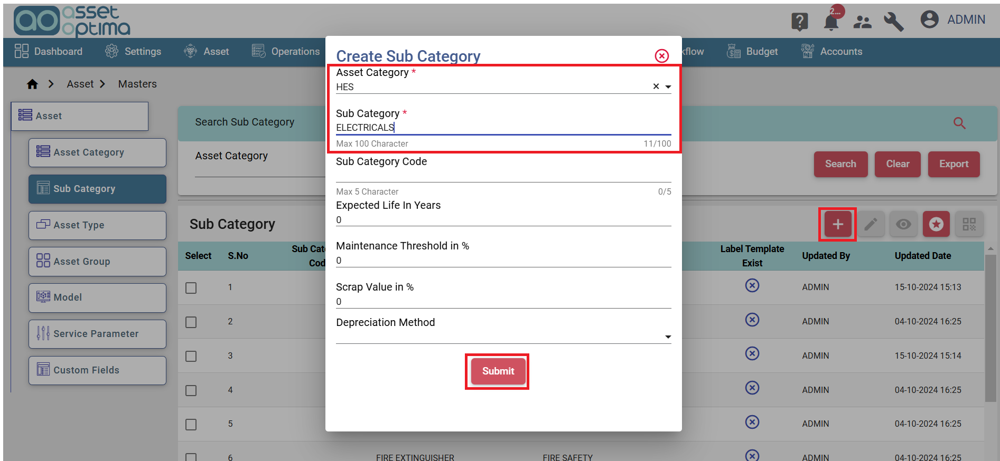

- To edit a Asset Sub Category record click the check box and click the edit button to edit the record.
- Fill in all the required details marked as important and click update button.

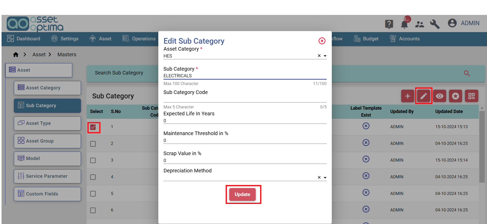

- Display Group:
    - The Display Group tab enables you to organize custom fields by grouping them under a defined display group.
    - Each display group has a unique name and color code, making it easy to visually differentiate fields. 
    - When creating custom fields, you can select an existing display group, and the fields will automatically adopt the group’s assigned color code. 
    - This feature helps in visually categorizing custom fields and improving readability on the screen.
- Create Display Group:
    - Click the display group icon, a window will be opened.

    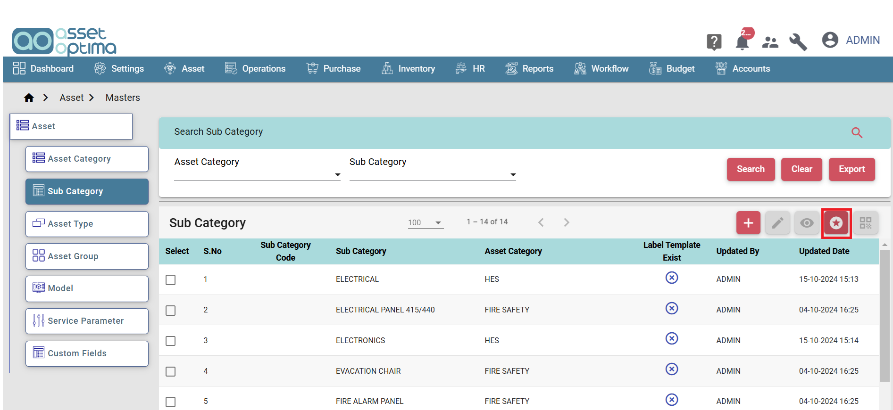

    - In this window give Display Group name and select a color.
    - Click the save button to save the record.

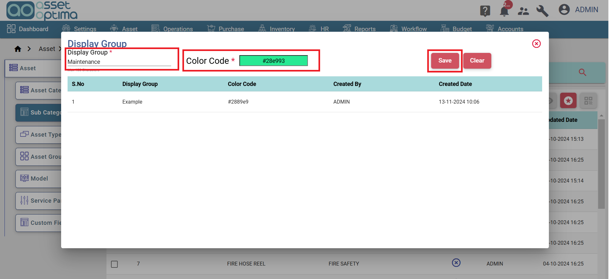

- Label Template:

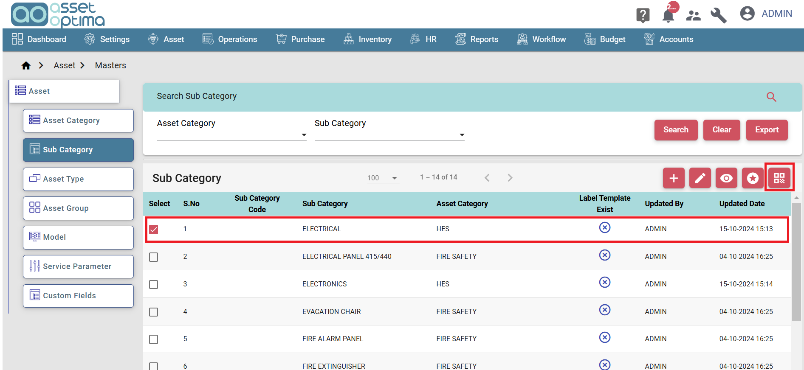
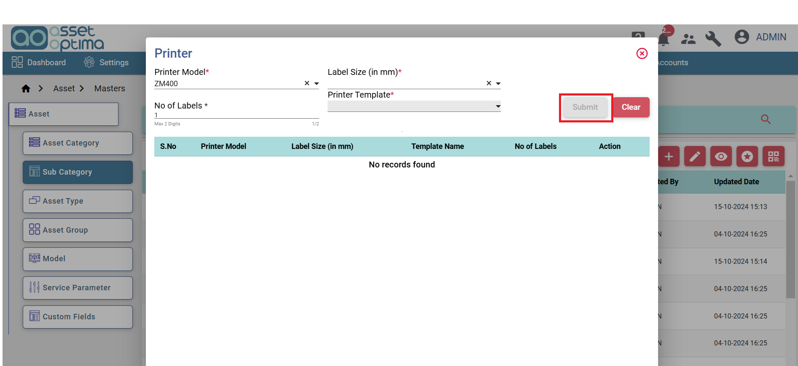

### Asset Type

> Asset Type categorizes assets based on how they can be identified and managed within the system. Classifying assets by type helps in organizing, tracking, and maintaining them efficiently.

- Introduction:
    - The asset type categorizes assets based on their purpose, usage, and financial impact within an organization. 
    - It helps in understanding the role each asset plays in daily operations and budget planning. 
    - For example, asset types might be classified as Major, Medium, or Minor. 
    - A Major asset typically has a high financial value and significant role in operations, whereas Minor assets are of lower value and importance. 
    - This classification assists in efficient asset management, maintenance planning, and financial forecasting.

- Asset Type Search:
    - To find a Asset Type, search the Asset Type in search field.

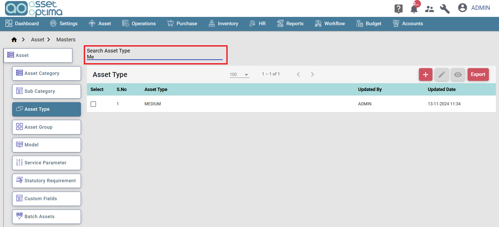

- Asset Type Create:
    - Click the "Create" button to create Asset Type and fill in all the required details marked as important. 
    - Click the submit to create the Asset Category.

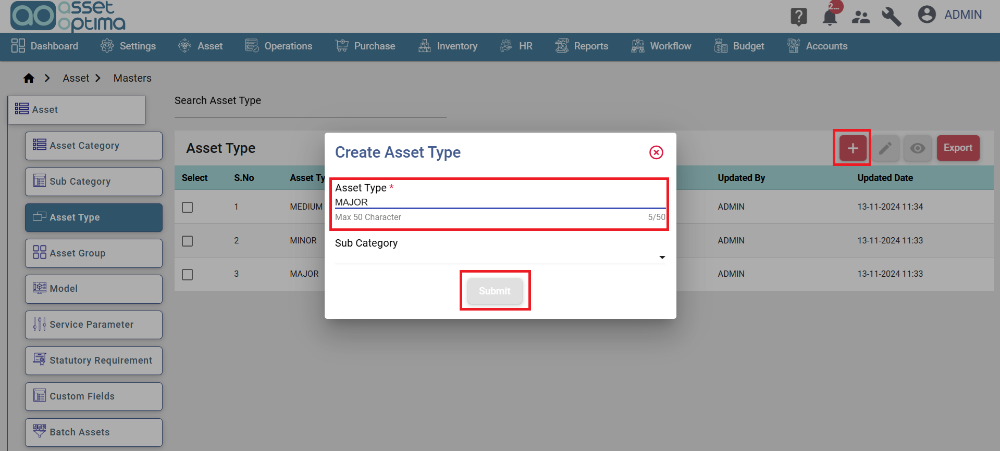

- Asset Type Edit:
    - To edit a Asset Type record click the check box and click the edit button to edit the record.
    - Fill in all the required details marked as important and click update button.

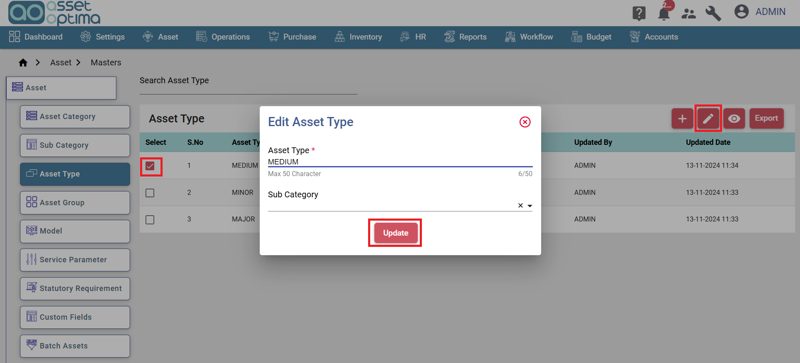

### Asset Group

> A distinct version of an asset item as defined by its manufacturer or design specifications, indicating particular features, performance capabilities, and configurations.

- Intorduction:
    - An asset group is a category that organizes assets with similar features, specifications, or functions, as defined by their manufacturer or design. 
    - This grouping helps to easily identify and manage items that share common performance capabilities or configurations. 
    - For instance, Battery Chargers could be an asset group containing various models of chargers used across the organization. 
    - Asset groups simplify tracking, maintenance, and reporting by organizing items with shared characteristics into a single category.

- Asset Group Search:
    - Using the search option in the list screen Asset Group records can be filtered.
    - Based on Asset Group, Asset Type, Asset Category and Asset Category, the Asset Group records can be filtered.
    - Choose the options in the dropdown and click the search button to filter the record.

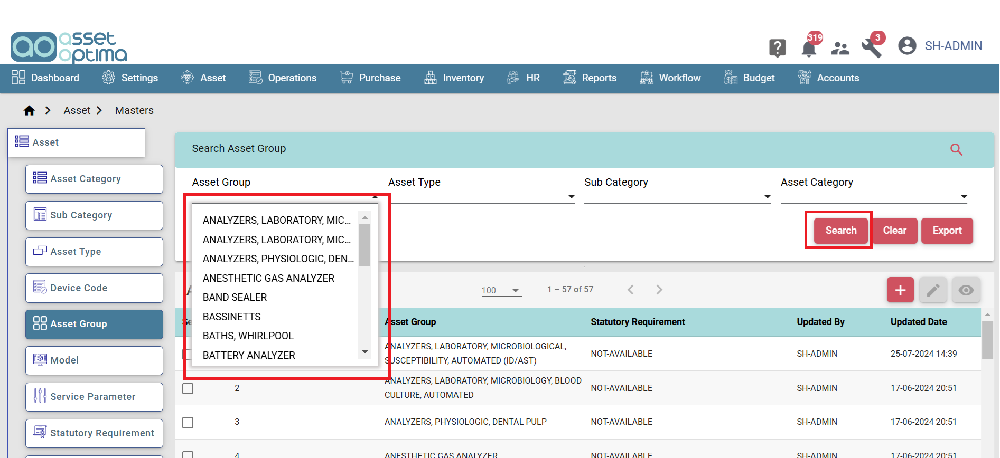

- Asset Group Create:
    - Click the "Create" button to create Asset Group and fill in all the required details marked as important. 
    - Give a name for the Asset Group, choose asset category and sub category.
- Basic Information

    - This section provides essential details about the asset group you are creating. Please fill in the following fields accurately:

    - Asset Group Name: Enter a clear and concise name for the asset group. For example, "Battery Chargers" or "Desktop Computers."

    - Asset Group Code: Assign a unique code to the asset group. This code is used for internal identification and tracking purposes. It should be short and easy to remember.

    - Expected Life in Years: Estimate the expected lifespan of the assets within this group. This information helps in planning for future replacements and maintenance.

    - Functionality: Indicate the primary function or purpose of the assets in this group. This helps in determining the appropriate maintenance and calibration schedules.

    - Off-Warranty Maintenance Strategy: Define the maintenance strategy to be followed for assets after their warranty period expires. This could involve in-house maintenance, outsourcing, or a combination of both.

    - QA Strategy: Specify the quality assurance procedures and standards that will be applied to the assets within this group. This ensures that the assets maintain their performance and reliability throughout their lifespan.

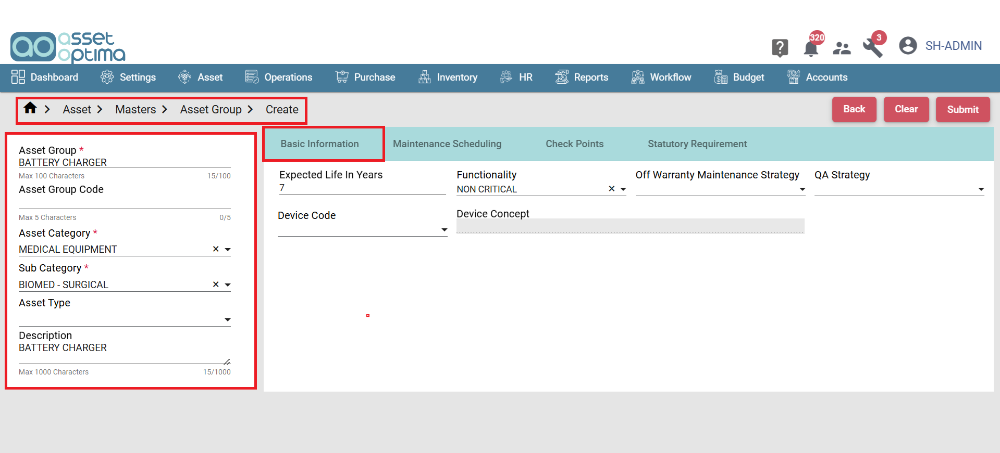

- Maintenance Scheduling

    - This section allows you to define the maintenance schedule for the assets within this asset group. This ensures that preventive maintenance tasks are performed regularly, minimizing downtime and optimizing asset performance.

    - Schedule Type: Select the type of maintenance schedule you want to implement. The available options are:

        - Daily Rounds: Regular inspections and checks performed daily.
        - Performance Assurance: Scheduled checks to assess the asset's performance and identify potential issues.
        - Preventive Maintenance: Planned maintenance activities to prevent breakdowns and ensure optimal operation.
        - Quality Assurance: Maintenance tasks related to quality control and standards adherence.

    - Schedule Frequency: Specify how often the maintenance tasks should be performed. The frequency options include:
        - Daily
        - Weekly
        - Monthly
        - Quarterly
        - Annually

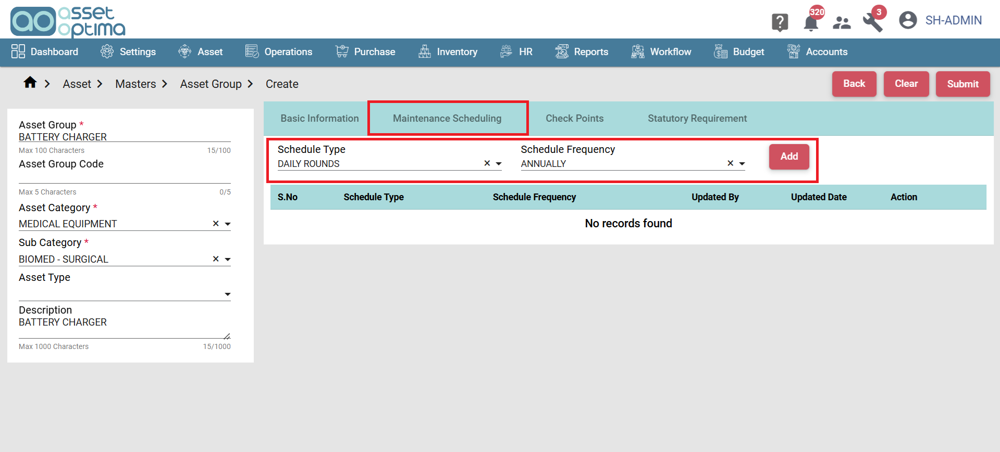

- Check Points
    - This section allows you to define specific inspection and verification points for your assets. These checkpoints help ensure that your assets are functioning correctly and identify potential issues early on.

    - Parameter Type: 
        - Select the type of check point, such as visual inspection, functional test, or measurement.
    - Parameter Group: 
        - Group related check points together for better organization.
    - Parameter: 
        - Describe the specific check point, e.g., "Check for oil leaks," "Verify voltage output," or "Measure temperature."

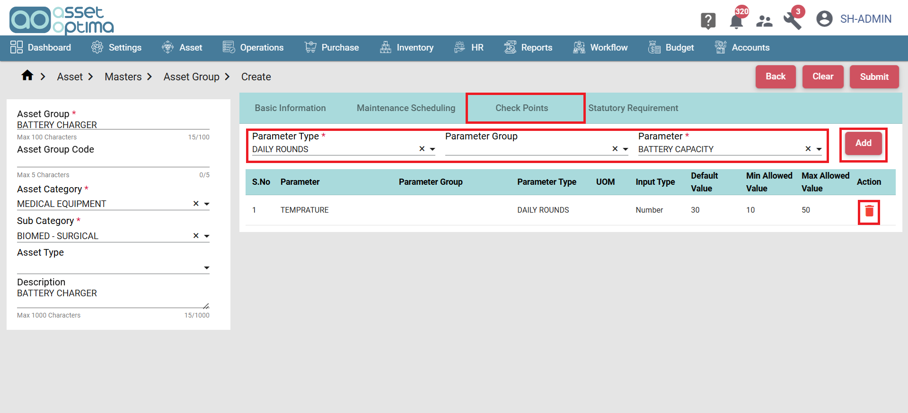

- Statutory Requirement
    - This section allows you to track and manage statutory compliance requirements for your assets. 
    - This ensures that your assets meet all legal and regulatory standards.

    - Asset Certificate Name: 
        - Enter the name of the statutory certificate, such as "Fire Safety Certificate," "Electrical Safety Certificate," or "Pollution Control Certificate."
    - Click the add button to add the certificate to this group.
    - Finally after filling all the required data click the "Submit" button.

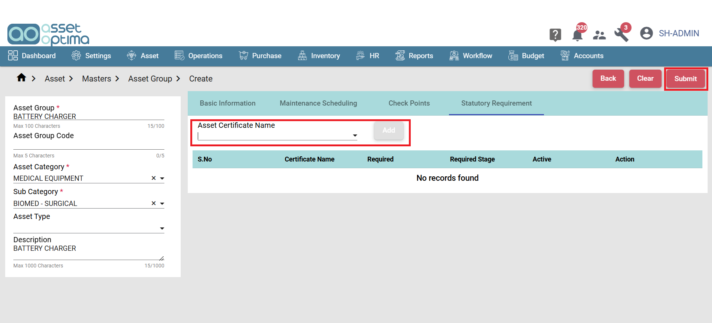
    
- Asset Group Edit:
    - To edit a Asset Group record click the check box and click the edit button to edit the record.
    - Fill in all the required details marked as important and click update button.

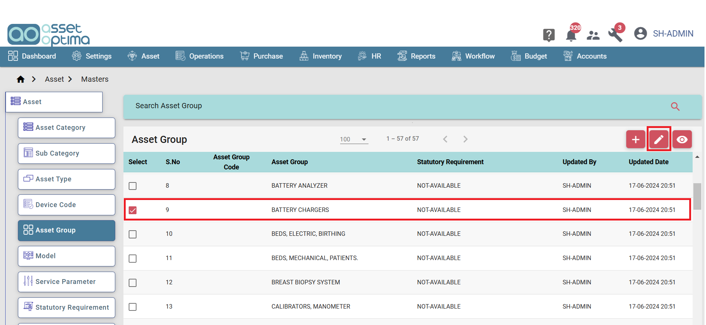

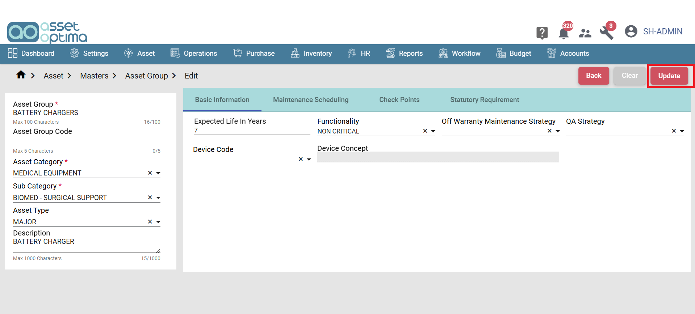

### Model

> A distinct version of an asset item as defined by its manufacturer or design specifications, indicating particular features, performance capabilities, and configurations.

- Introduction:

    - A model represents a specific version of an asset item, as defined by its manufacturer or design specifications. 
    - It identifies the unique set of features, performance capabilities, and configurations of the item. Models allow easy distinction between similar asset types with different attributes. 
    - Each model maintains standardized information, enabling consistent tracking and management of assets.

- Model Search:

    - Using the search option in the list screen Model records can be filtered.
    - Based on the given filter options records can be filtered.
    - Choose the options in the dropdown and click the search button to filter the record.

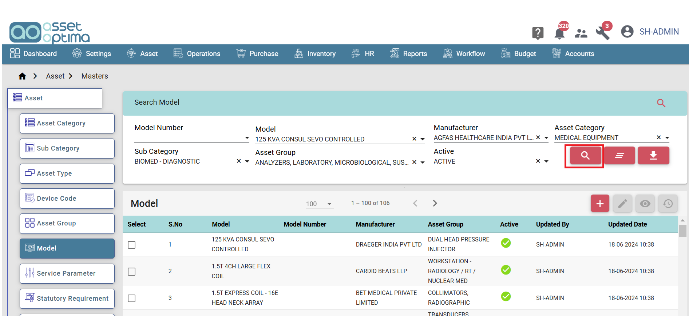

- Model Create:

    - Click the "Create" button to create Model and fill in all the required details marked as important.

    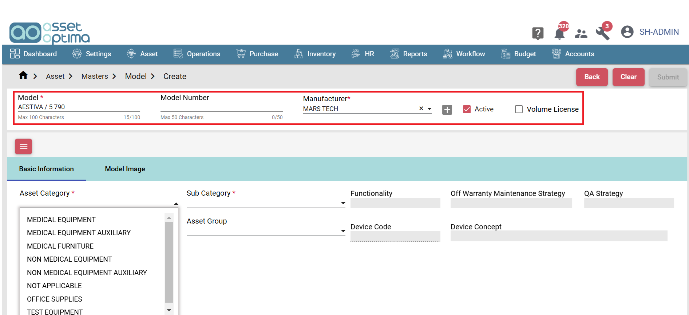 

    - Enter the data in mandatory fields, if Asset Category is selected some tabs will be enabled.

    - Basic Information:
        - This section captures the fundamental details about the model, including its categorization, type, and functional characteristics.

    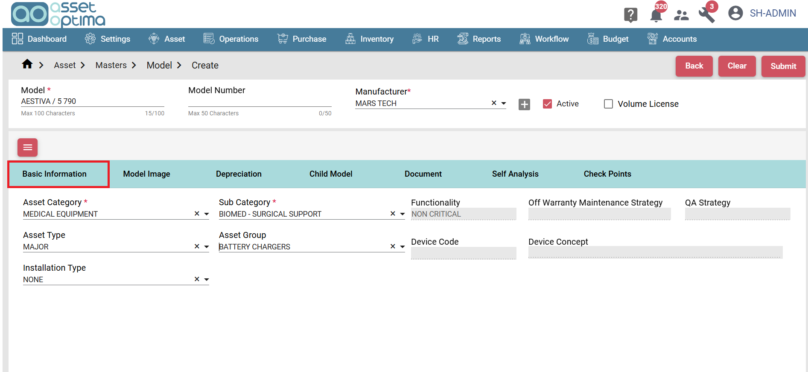 

    - Model Image:
        - In this tab you can provide model image.
        - Click the file icon and choose an image.
        - To delete the selected image click the delete icon.
    
    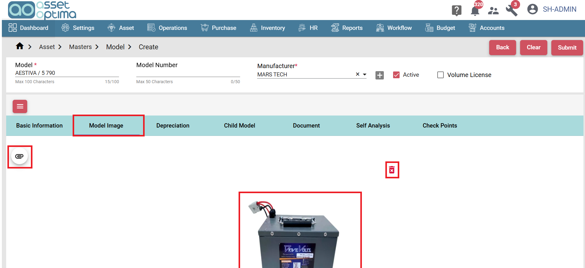 

    - Depreciation:
        - The Depreciation tab provides a platform to define the depreciation parameters for the model.
        - Depreciation is an accounting method used to allocate the cost of a tangible asset over its useful life.

    - Expected Life in Years: 
        - Specify the estimated lifespan of the model in years. This value determines the rate at which the asset's value will depreciate.
    - Depreciation Method: 
        - Select the appropriate depreciation method from the dropdown list.
    - Maintenance Threshold in %: 
        - Define the percentage of the asset's original cost at which maintenance expenses should be considered.
    - Scrap Value in %: 
        - Specify the estimated salvage value of the asset at the end of its useful life. This value represents the amount that can be recovered from the asset when it is disposed of.

    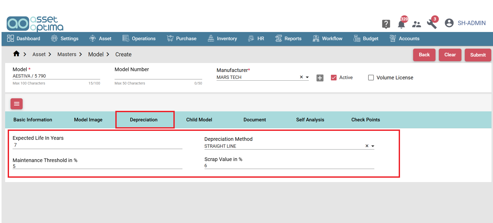 

    - Child model:
        - The Child Model tab allows you to define child models or sub-models within a parent model.

        - Select the asset group and model from the dropdown and click the add button to add a child model for the parent model.
        - Click the "delete" icon to delete the child model.

     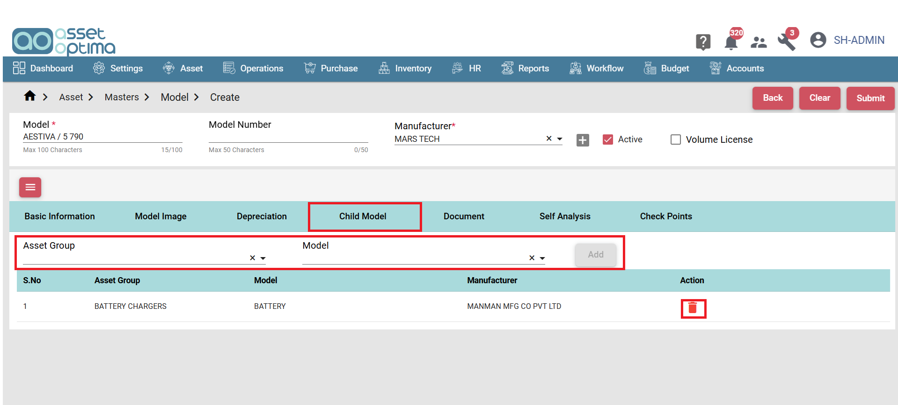 

    - Document:
        - The "Documents" tab allows you to upload and manage documents related to the model. This includes technical specifications, user manuals, maintenance records, and other relevant files.
        - Click the add button in the Documents tab, a window will be opened.
        - Provide the document field enter the document name.
        - Choose document type and choose the document by clicking the file icon.
        - click the "submit" button to add the document to the model.
    
    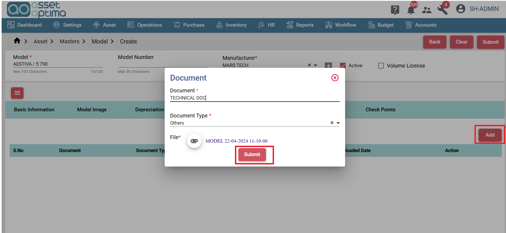 

    - Check Points
        - This section allows you to define specific inspection and verification points for your assets. These check points will be attached to the model.

        - Click the check points tab and choose parameter type, parameter group and parameter.
        - Click the "Add" button to add this check point to the model.
   
   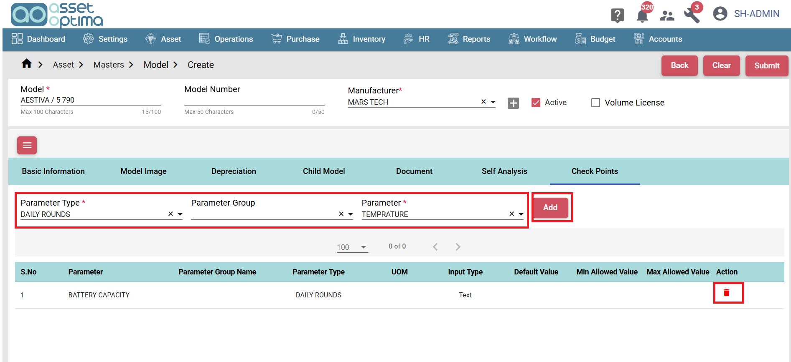 

- Model Edit:
    - To edit a Model record click the check box and click the edit button to edit the record.
    - Fill in all the required details marked as important and click update button.

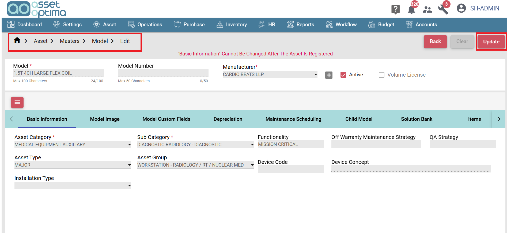

### Service Parameter

> The Service Parameter tab allows you to define specific inspection and verification points for your assets. These checkpoints help ensure that your assets are functioning correctly and identify potential issues early on.

- Parameter Type

    - This field specifies the overall category or type of inspection or verification that needs to be performed on the asset. It helps to classify the check points into broader categories for better organization and analysis.
    
    - Example:
        - Daily Rounds: Routine inspections and checks performed daily to ensure the asset's operational health.
        - Preventive Maintenance: Scheduled maintenance tasks to prevent breakdowns and ensure optimal performance.
        - Performance Assurance: Regular checks to assess the asset's performance and identify potential issues.
        - Quality Assurance: Maintenance tasks related to quality control and standards adherence.

    - Enter the parameter type name in the search field, the record will be filtered.

    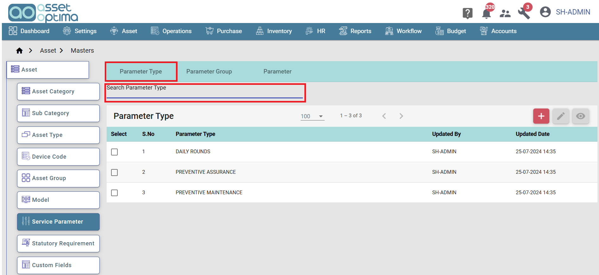

    - Click the "Create" button to create parameter type and fill in all the required details marked as important.
    - Enter the Parameter Type and click the sumbit button to save the record.

    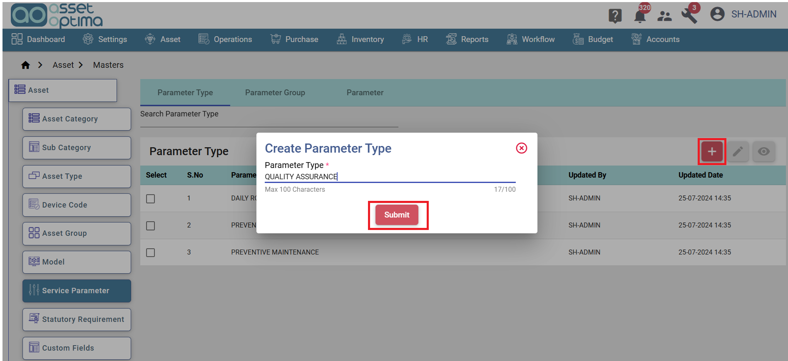

    - To edit a Paramemter Type record click the check box and click the edit button to edit the record.
    - Change the Parameter Type name and click update button.
    - To View a Paramemter Type record click the check box and click the view button.

    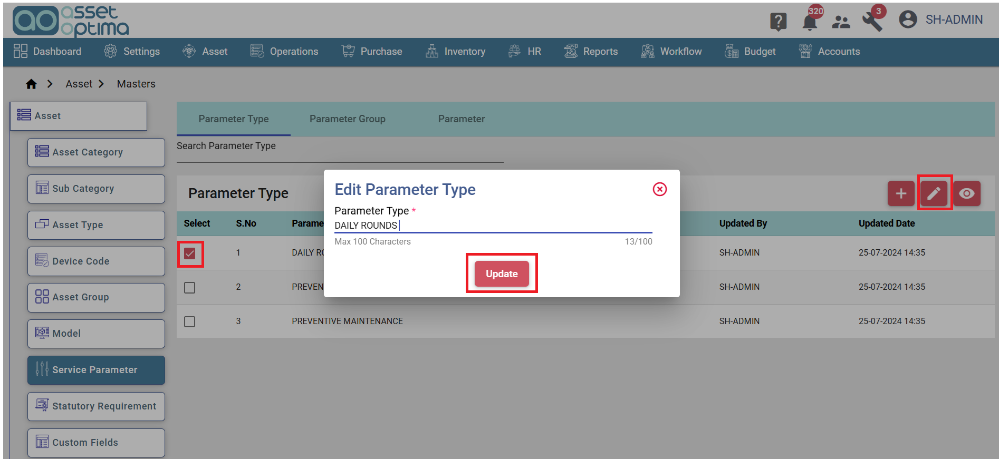

- Parameter Group

    - This field further categorizes check points within a specific parameter type. It helps to group related check points together for better organization and easier management.
    
    - Example:
        - General Appearance: Visual inspections for signs of damage, corrosion, or wear.
        - Electrical Components: Checks on electrical components like switches, relays, and fuses.
    
    - Enter the parameter group name in the search field, the record will be filtered.

    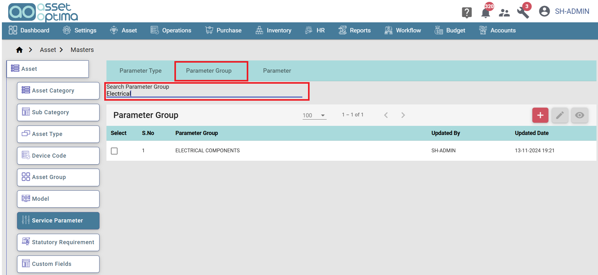

    - Click the "Create" button to create parameter group and fill in all the required details marked as important.
    - Enter the Parameter Type and click the sumbit button to save the record.

    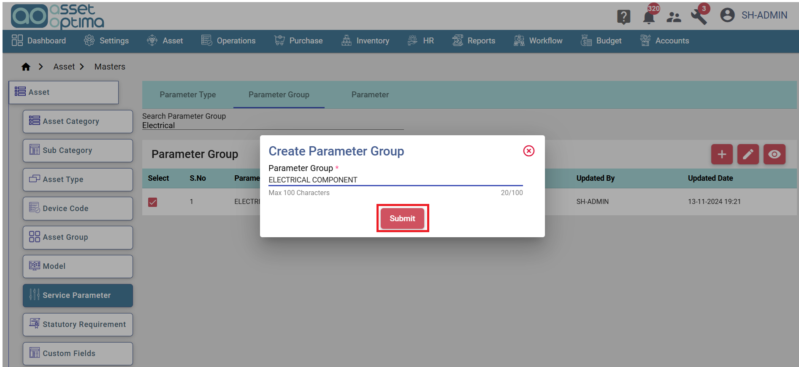

    - To edit a parameter group record click the check box and click the edit button to edit the record.
    - Change the parameter group name and click update button.
    - To View a parameter group record click the check box and click the view button.
    
    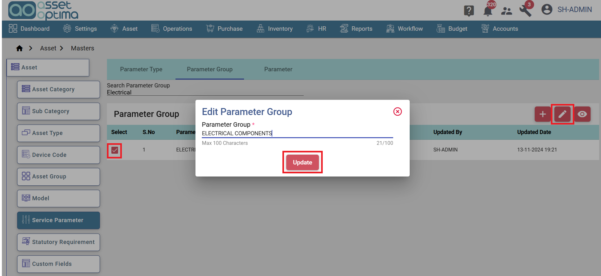

- Parameter
    - This field describes the specific inspection or verification point to be performed. It should be clear, concise, and easy to understand.

    - Example:
        - Temprature
        - Battery Percentage
    
    - Enter the parameter in the search field, the record will be filtered.

    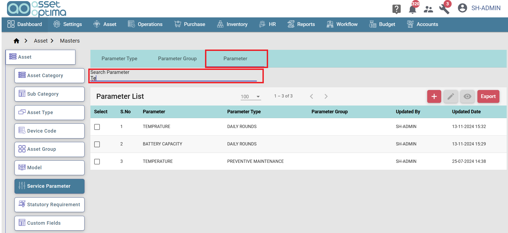

    - Click the "Create" button to create parameter and fill in all the required details marked as important.
    - Enter the Parameter Type and click the sumbit button to save the record.

    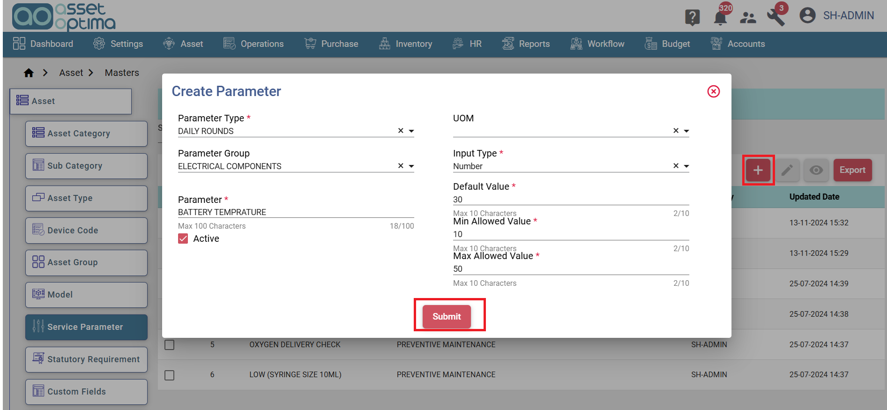

    - To edit a parameter record click the check box and click the edit button to edit the record.
    - Change the parameter name and click update button.
    - To View a parameter record click the check box and click the view button.
    
    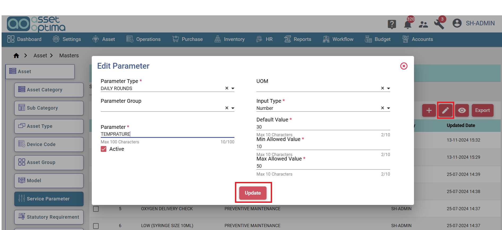

### Statutory requirements

> The Certification module in Asset Optima enables you to define and manage various certificates associated with assets. These certificates can be used to verify the authenticity, compliance, or other relevant information about an asset.

### Custom Fields

