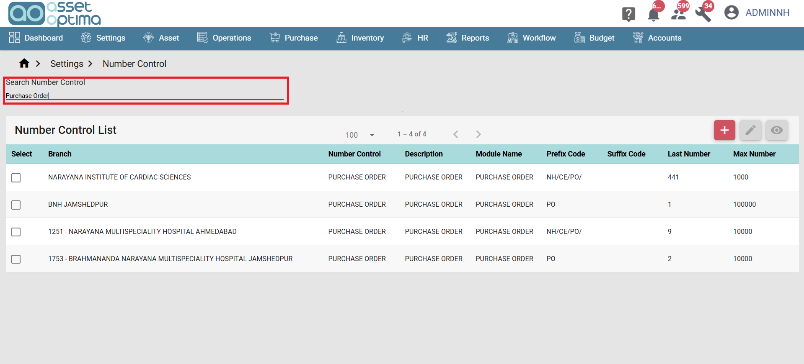
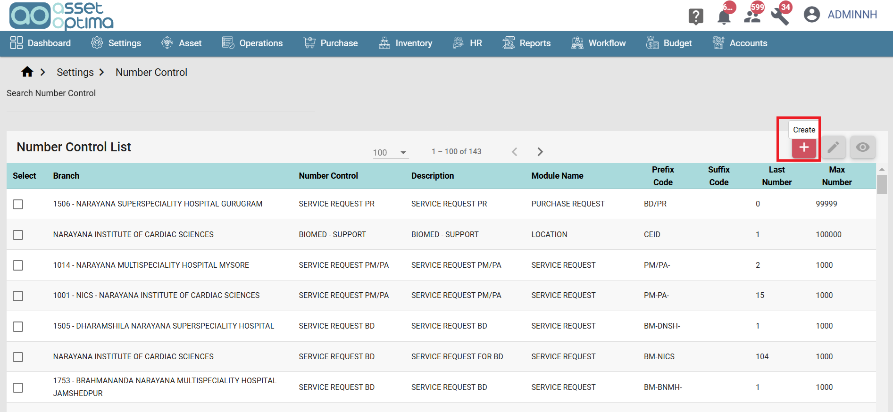
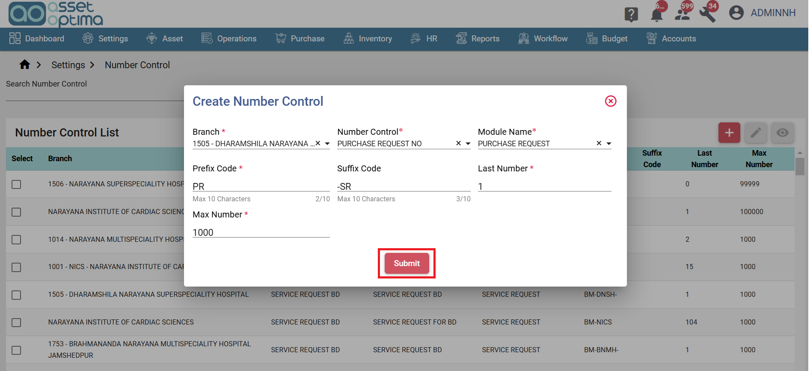
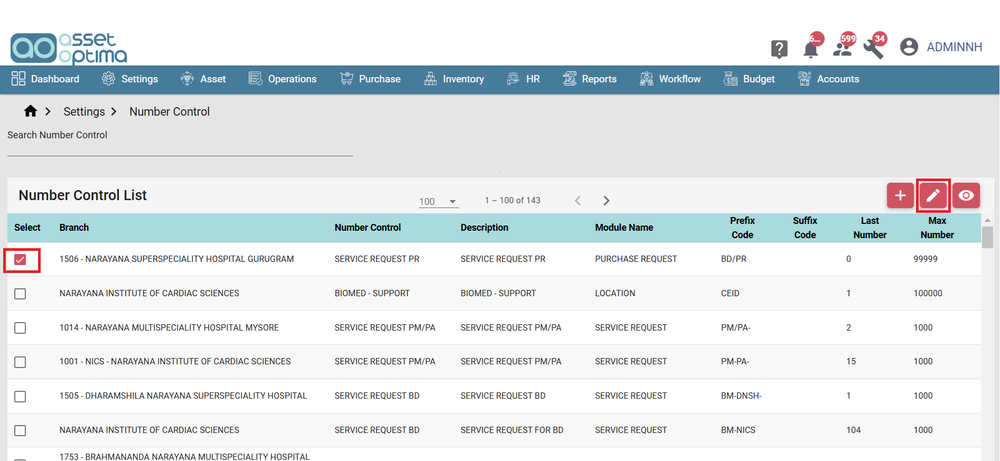
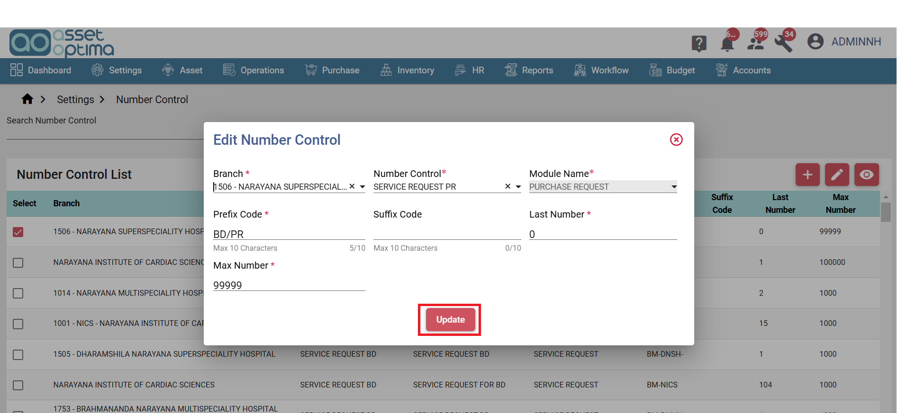

## Introduction

>- Number Control is used to automatically generate unique identifiers for records across different modules, ensuring consistency and traceability. 
>- This configuration allows you to define the structure of the generated numbers, including a prefix, suffix, and sequence range.

1. Prefix Code
A fixed string (e.g., "PR" for Purchase Request) that precedes the number.

2. Suffix Code
A fixed string (e.g., "-SR") that follows the number, used for additional categorization.

3. Last Number
The starting point for the sequence. The system will begin numbering from this value.

4. Max Number
The upper limit of the sequence. Once this number is reached, the system will stop generating new identifiers.

### Number Control List Screen

> The Number Control List Screen displays all created number controls for various modules.

- Users can search and filter the list using the search to quickly find specific number controls. 
- This provides a convenient way to view and manage existing configurations.

### Create Number Control

> The Create Number Control feature allows users to define unique number generation rules for different branches and modules. 

- Click the create button to create number control for specific module. 

- Select branch, Number control and Module name then enter the Prefix Code, Suffix Code, Last Number, and Max Number.
- Click the submit button to save.
- This ensures that each module (e.g., Purchase Request, Purchase Order) within a specific branch generates distinct identifiers while maintaining consistency across the system.

### Edit Number Control

> The Edit Number Control screen allows users to modify the existing number control settings for a selected branch and module.

- To edit a number control, simply select an item from the list and click the Edit button.

- Click the update button to save the changes.

