# Organization Introduction {docsify-ignore}
> This module helps to create/edit basic infrastructure of an organization. Organization registration can be done only during installation of the Asset Optima, one can only be able to edit the organization details.
The following flow chart briefly describe the organizations and relation with its sub modules.

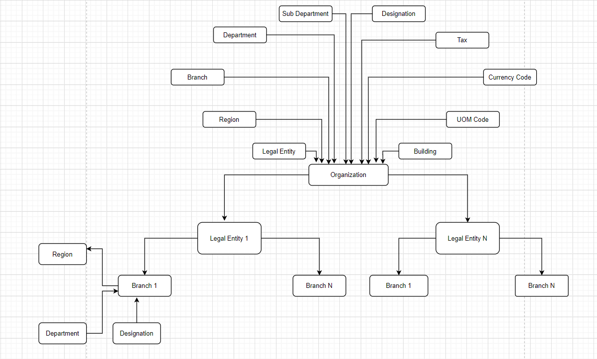

- Navigation : Settings --> Organization
- Organization details will displayed as shown in the picture.

 

 User can alter the organization details by clicking on edit button in the organization detail page. The following figure shows the edit page for an organization. 

 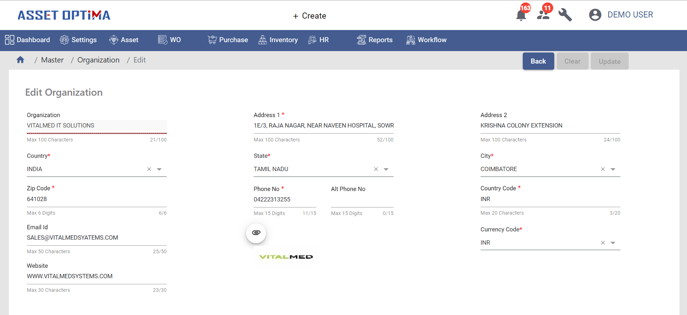

### Legal Entity
> Dividing the organization into groups based on certain functionalities so that transactions can be handled efficiently.
- List of legal entities of an organization are displayed as shown in the below picture.

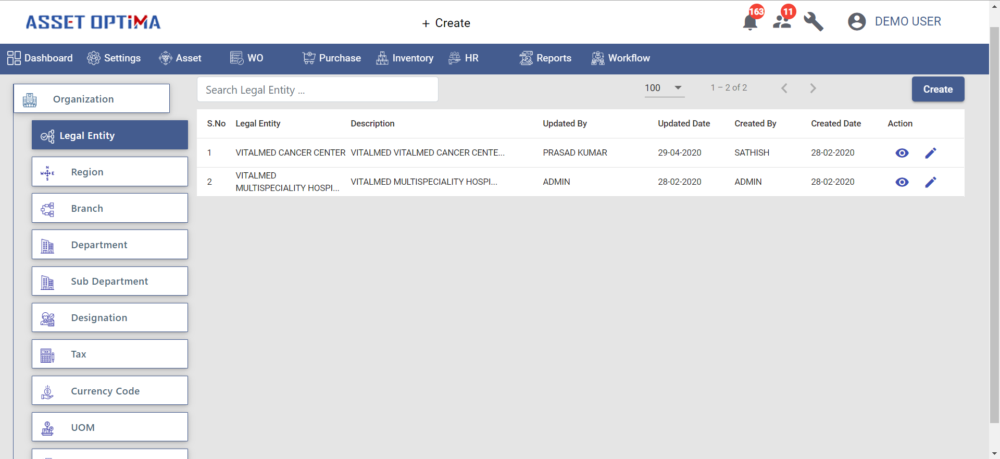

- User can create a new legal entity by clicking on create button on the right top corner.

* Legal Entity Create Page:
 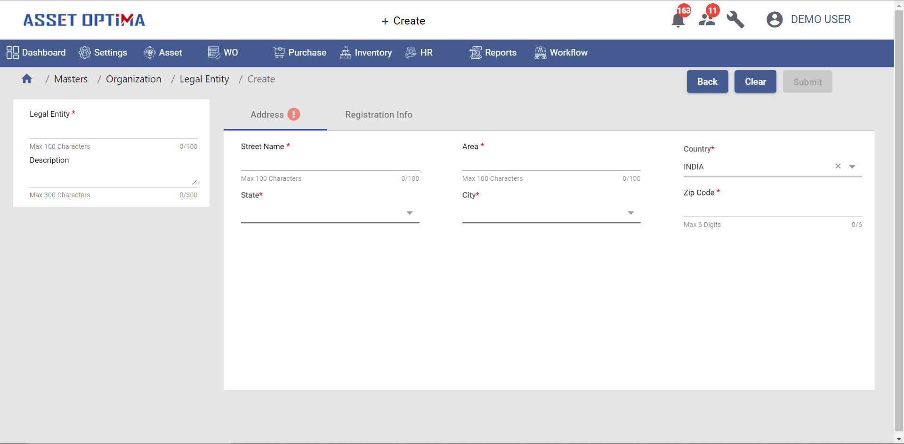

 * Field Descriptions:
   * Legal Entity: Specific name of the group.
   * Description: Detailed description for the name specified.
   * Address (Tab): Basic address details. 
   * Back button: redirect to legal entity page
   * Clear button: Clears all the fields.
   * Submit button: save the details and redirect back to legal entity page(Enables only after entering data to mandatory fields).

 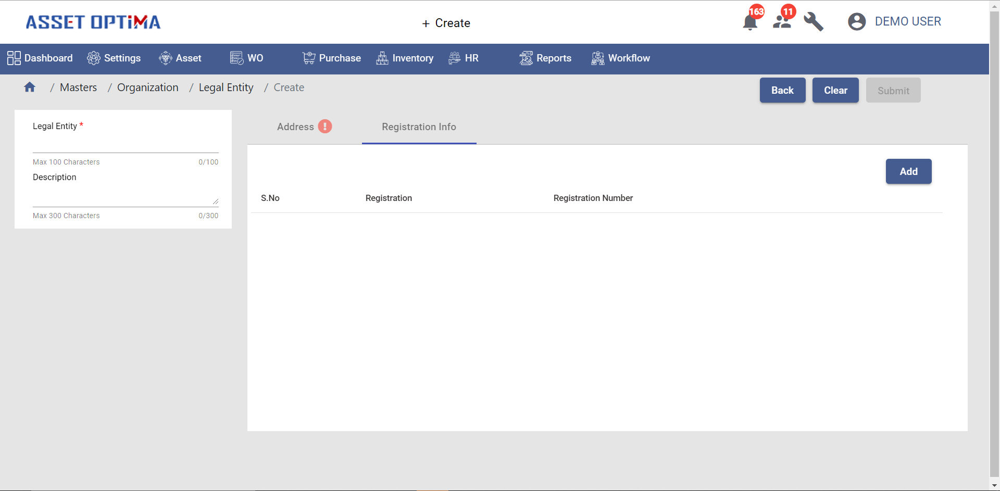  

 * Field Descriptions:
    * Add Button: Opens a new pop up to enter registration name and number.
   (Added registration information will be displayed in the table) 

- User can edit particular record by clicking on edit button in the grid which will redirect to legal entity create page with selected row details.   

### Region
> Dividing the organization in to groups based on location. User can create new region by clicking on create button.
 
- List of regions of an organization are displayed as shown in the below picture.

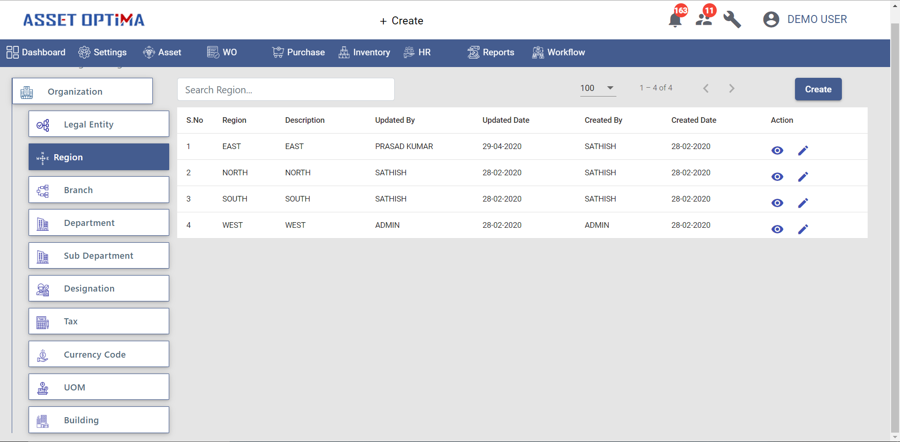

- User can add new region by clicking on create button which opens a dialogue box with fields region name and description as shown in below figure.

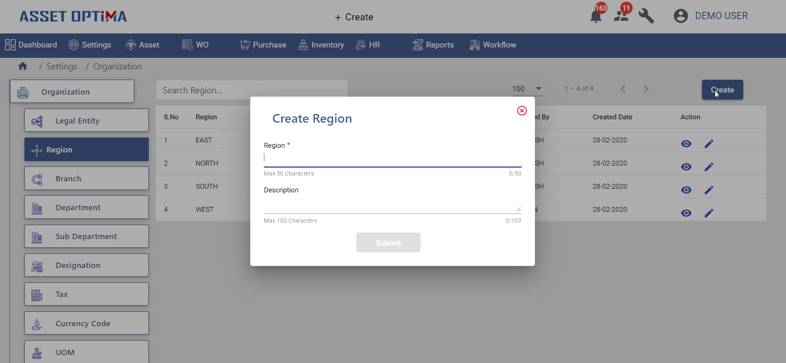

- User can also edit the particular record by clicking on edit icon in the table.

### Branch
> This is to create an individual branch, each branch need to map with particular legal entity and region.

- List of branch of an organization will bee displayed as shown in the picture below.

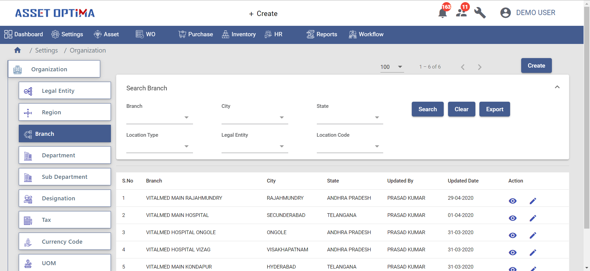

In branch home page user can search for particular branch based on different conditions as shown in the above figure.

Button description:
 * Search : Clicking on search button alter the table contents as per the search conditions.
 * Clear : Clears all the search fields.
 * Export : Generates a detailed excel report as per the search result.
 * Create : Opens a window to create new location(top right corner).

##### How to create a Branch ?
 - Click on create button in the branch home page(right top corner), this redirect to branch create page as shown in below picture.

 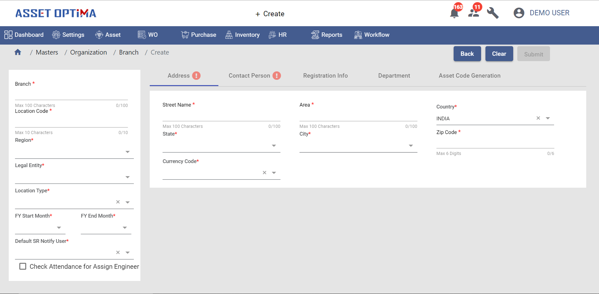

 * Field Description:
   * Button Description:
     * Back : Redirect back to branch home page.
     * Clear : Clears all the fields.
     * Submit : Save the record and redirect back to branch home page(Enables only if all the mandatory fields are filled).
   
   * Branch : Name of the branch
   * Location Code : Reference code for the branch
   * Region : Map the branch with any of the regions of an organization.
   * Legal Entity : Map the branch to any one of the legal entities of an organization.
   * Location Type : Specify whether the branch belong to service provider or end user.
   * FY Start Month/ FY End Month : Specifies the final year start and end month.
   * Default SR Notify user : Specifies the employee name, whenever a workorder is created for an asset of this particular branch, if no default SR notify person added for that asset then notification will be sent to this employee.
   * Address(tab) : Specifies location information.

      

   * Email Id : Branch email address.
   * Phone No : Branch phone number.
   * Alt Phone No : Alternate phone number.  

   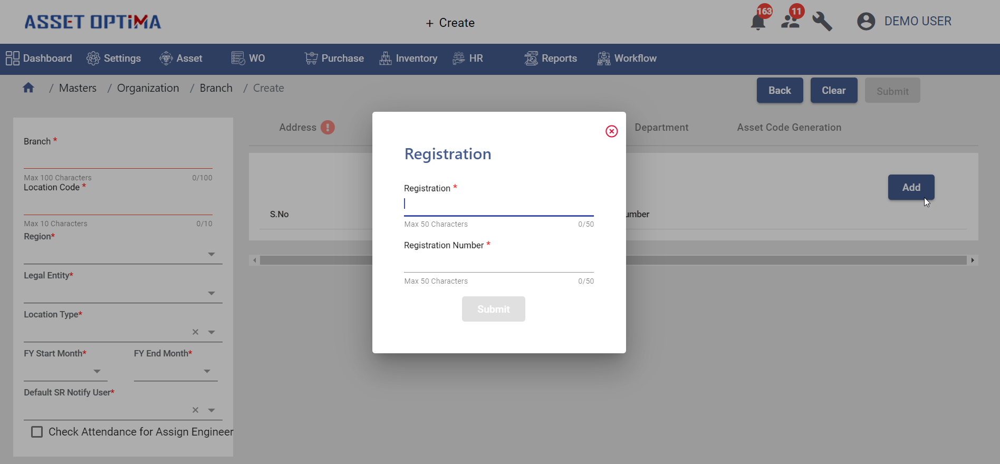

   * Registration Info : Clicking on add button in the registration tab(right top corner) open a dialog box with fields registration name and registration number(Added registration information will be displayed in the grid).

   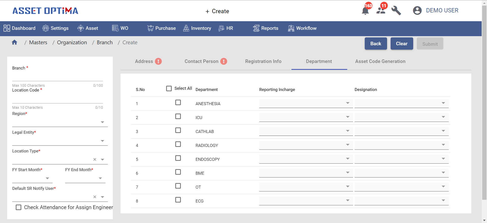
   * User can map particular department with branch and reporting person name for each department. This mapping further will be utilized in internal loan request.

   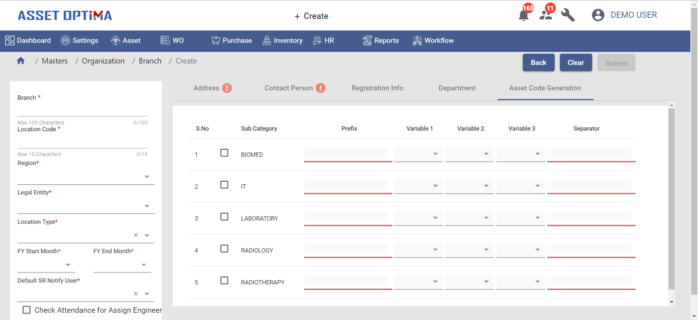

   User can select their own pattern for asset code. Upon selecting sub department name all the columns in that particular row will be enabled. The variables values will be replaced with original names.
   - Example: 
   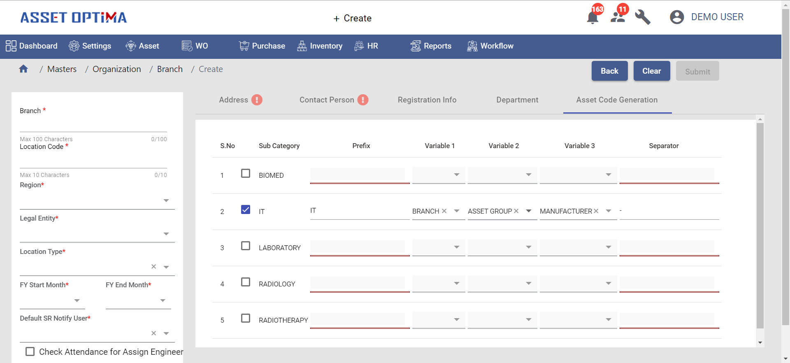

   In the above picture, when we create an asset(belong to IT sub category) the generated asset code will be 
     * IT-Branch_name-asset_group_name-manufacturer_name-unique_no

  The warning icon(right next to tab heading) indicates that all the required fields are not entered or entered data are incorrect.
  
  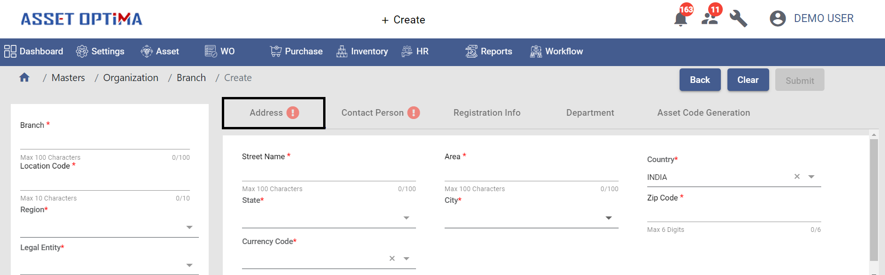
   
### Department
>User can register different departments that comes under an organization. The department list will be displayed as below.

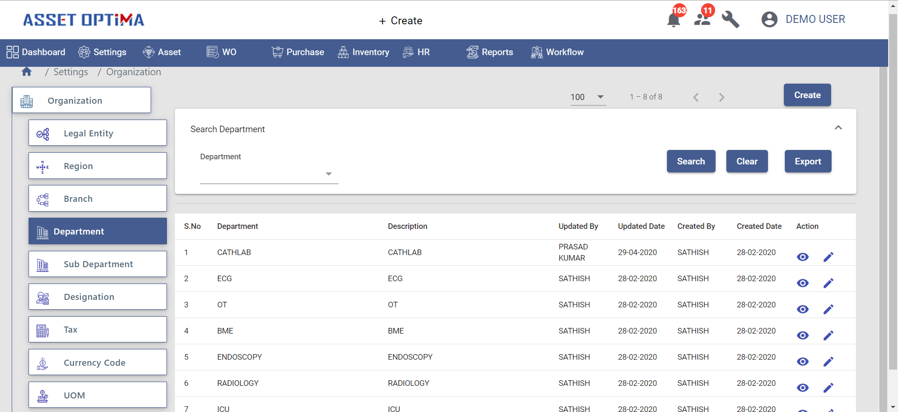

- User can edit/view particular department details by clicking on edit/view icons respectively in the action column of the grid.

- User can search for particular department.
- User can generate excel report by clicking on export button.

- User can add new department by clicking add button which opens a pop as shown below.

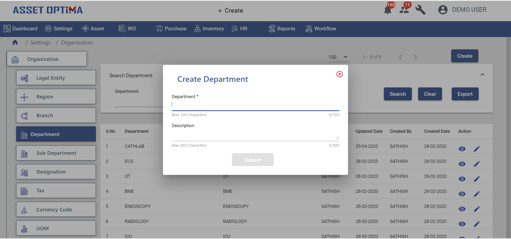

 Submit button will be enabled once user enters the name, upon clicking submit button the record will be saved and added to the grid.

### Sub Department
> User can register all the sub department of an organization, each sub department needs to map with any one registered department. The list of registered sub department will be shown as below.

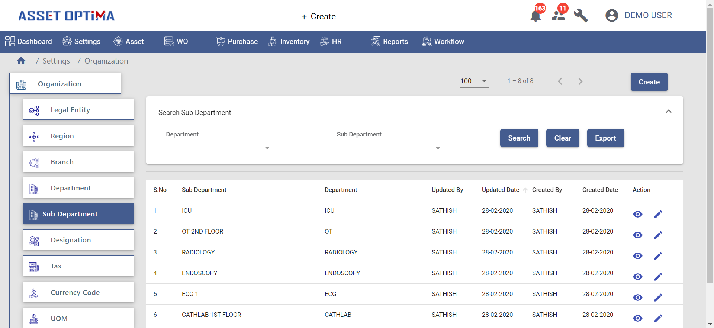

- User can search for sub department by sub department/ department name.
- User can edit/view the particular sub department details by clicking on edit/view icon respectively in the grid.
- User can also generate an excel report by clicking on export button.
- User can create new sub department by clicking on create button. The following picture shows the sub department create page.

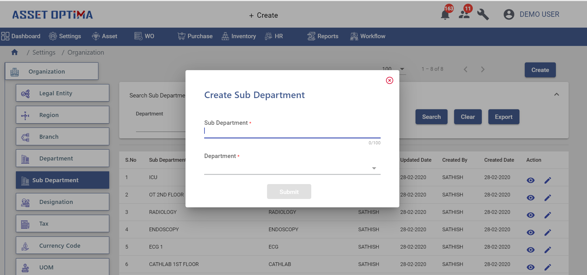

Submit button enables once the user enters sub department and department name, record will be saved upon clicking submit button and displayed in the grid.

### Designation
> User can register all the designations of an organization. The registered list of designations will be shown as below

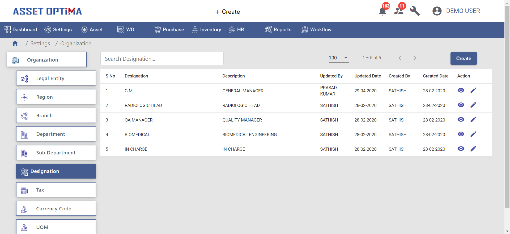

- User can search for particular designation(search field on top of the grid).
- User can edit/view the particular designation details by clicking on edit/view icon respectively in the grid.
- User can create new designation by clicking on create button.
- Below picture shows the create designation page.

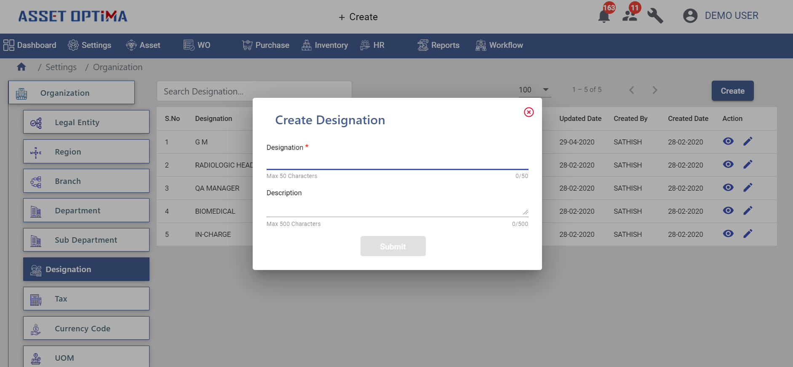

Submit button enables once the user enters designation name, record will be saved upon clicking submit button and displayed in the grid.

### Tax
> Different types of tax that are used for transaction can be registered along with its tax rate. List of registered tax types are displayed as shown below.

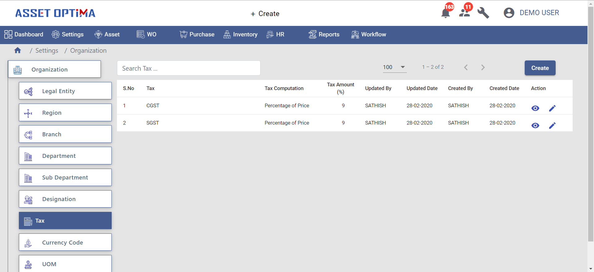

- User can search for particular tax type(Search field in the top of the grid).
- User can edit/view the particular tax details by clicking on edit/view icon respectively in the grid.
- User can create new tax type by clicking on create button.
- Below picture shows the create tax page.

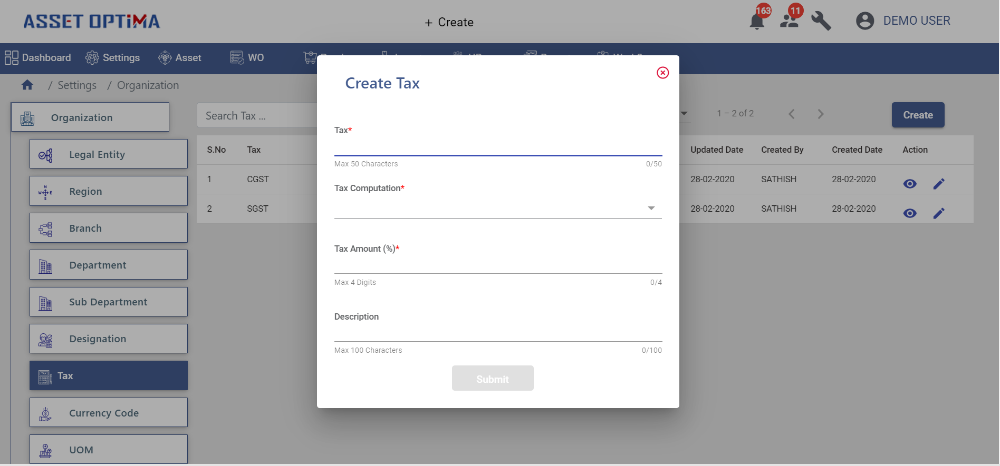

* Field Description:
 * Tax: Tax type name.
 * Tax Computation: Provided 2 types of calculations.
   * Percentage of price
   * Percentage of price included with tax
 * Tax Amount: Tax percentage.
 * Description: Brief description.

### Currency Code
> Different types of currency code that are being used in an organization for transaction can be registered. List of registered currency code will be displayed as shown below.

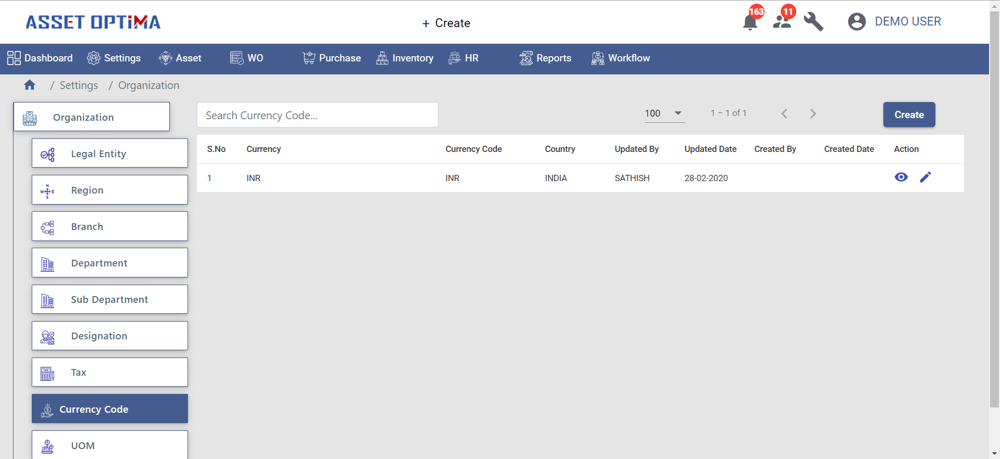

- User can search for particular currency code(Search field on top of grid).
- User can edit/view the particular currency code details by clicking on edit/view icon respectively in the grid.
- User can create new currency code by clicking on create button.
- The following picture shows the currency code create page.

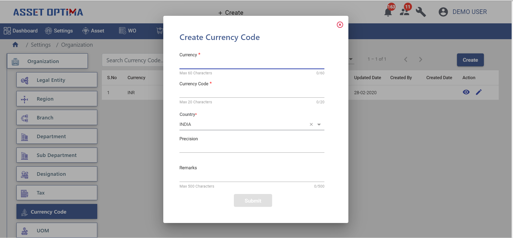
 
* Field Description:
 * Currency: Currency type.
 * Currency Code: currency code for the entered currency type. 
 * Country : Select country(List of countries need to be loaded during installation)
 * Precision: 
 * Remarks : Brief remark if needed.

### UOM Code
> Different parameters that are used to measure item/asset can be registered, List of registered UOM code will be displayed as shown in the below figure.

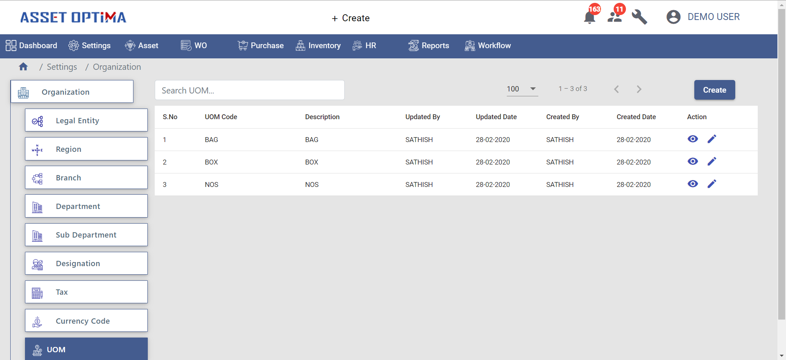

- User can search for particular uom code(Search field on top of grid).
- User can edit/view the particular uom code details by clicking on edit/view icon respectively in the grid.
- User can create new uom code by clicking on create button.
- The following picture shows the uom code create page.

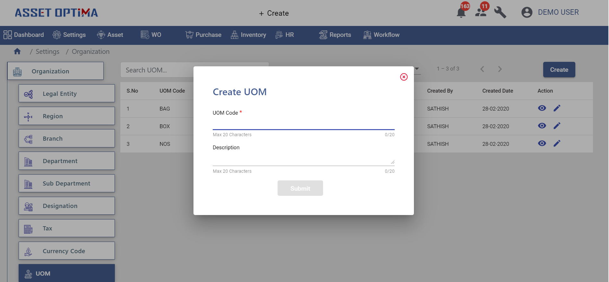

### Building
>- This module helps to identify the physical location of an asset. User can register different buildings, its related floors and rooms.
>- Block, floor, segment and rooms are interlinked.

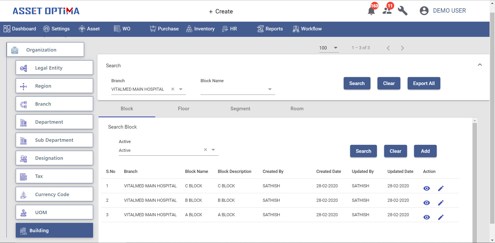

- By default branch(search) will be set to login user branch and all tabs shows particular branch related data. User can also search building information of other branches.
- Once the block name is selected(search) all other tabs displays selected block related data.
- User can generate detailed excel report by clicking on export all button.
- By default all the active(currently in use) building information will be displayed, user can also search for in-active(not in use) building information.
- User can edit/view particular block detailed information by clicking on edit/view icon in the grid.

##### Block
- By default all the block related to login user branch will be displayed.
- User can create new block by clicking on add button.
- Block create page as shown below.

* Field Description:
  * Branch: Branch name(By default login user branch will be selected).
  * Block: Name of the block.
  * Description: Brief description about block.
  * Active: Represent currently in use or not.

- Submitted data will be stored and displayed in the grid.

##### Floor

- By default all the floor information related to the login user branch will be loaded as shown in below picture.
- User can also search for particular floor data by selecting floor name and clicking on search button.
- User can edit/view the details about particular floor by clicking on edit/view icon respectively in the grid.

- User can Create new floor by clicking on add button, which open a new pop-up as shown below.

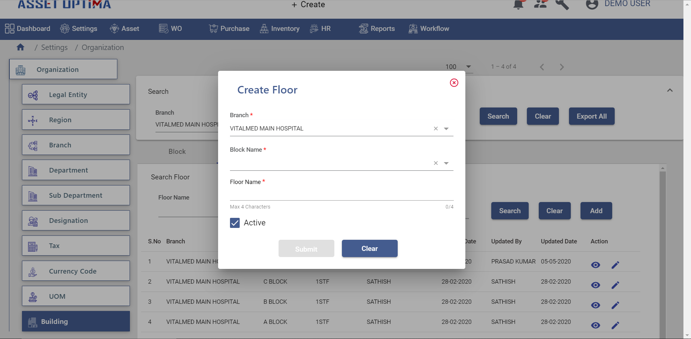

* Field Description
 * Branch: Select the branch name(by default login user branch will be displayed).
 * Block Name: Each floor must be mapped to any one of the registered block(the combo displays only the blocks of selected branch), if no block are registered for selected branch then displays 'no item found'.
 * Floor Name: Floor name(only 4 characters were allowed).
 * Active: By default set to active i,e in use.
- Submit button enables once all the required fields are entered, clicking on submit button save the record and displayed in the grid.

##### Segment
- Segment indicates particular portion/part of the building.
- User can search for particular segment by selecting segment name and clicking on search button.
- User can edit/view particular segment data by clicking on edit/view button.
- Segments are not linked with floor/block.

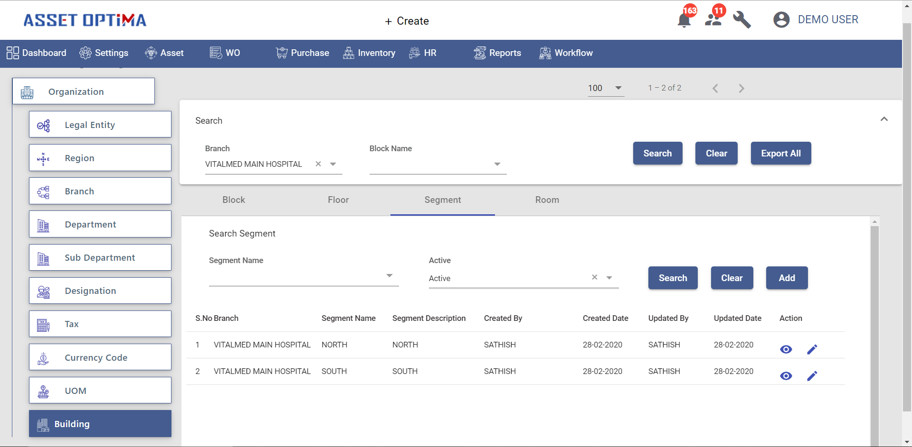

- User can create new segment by clicking on add button, which opens a new pop-up as shown below.

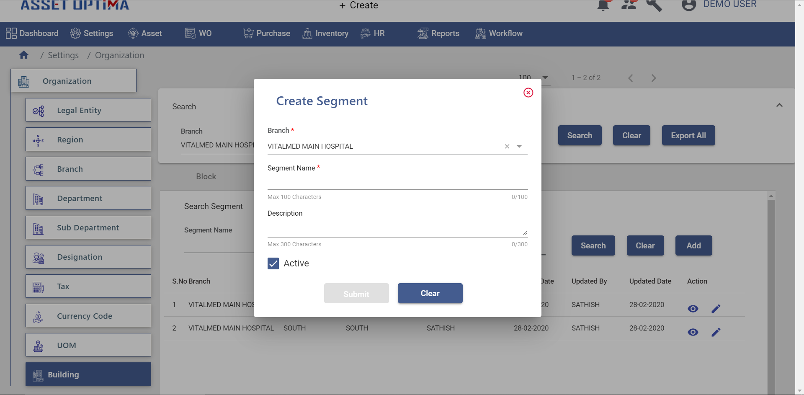

* Field Description:
  * Branch: Select the branch name(By default displays login user branch).
  * Segment Name: Name of the segment.
  * Description: Brief description about segment.
  * Active: By default set to active.
- Submit button will be enabled only if all the required fields are entered, upon clicking record will be saved and displayed in the grid.

##### Room 
- Specifies each room in a building, the room name is mapped to floor name and its respective block name and to particular segment.
- User can edit/view details of the room by clicking on edit/view button respectively in the grid. 
- The registered rooms will be displayed as shown below.

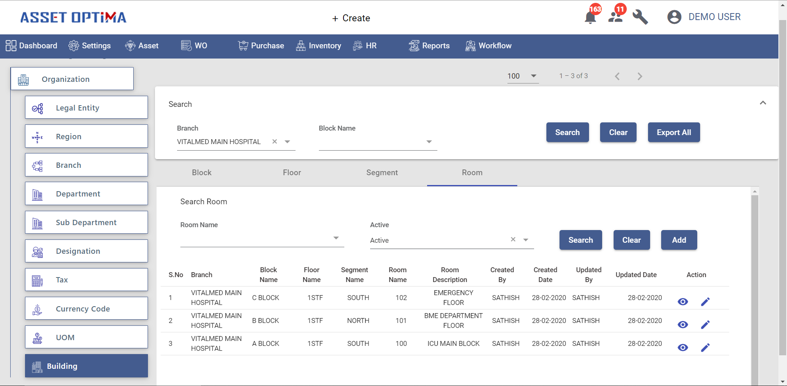

- User can create new room by clicking on add button, the following picture shows room create pop-up.

* Field Description:
 * Branch: Select the branch name(by default displays login user   branch name).
 * Block Name: Displays list of blocks related to selected branch, if no blocks registered for selected branch then displays 'no item found'.
 * Floor name: Displays list of floor related to block name, if no floor registered for selected block then displays 'no item found'.
 * Segment name: Displays list of segments related to selected branch, if no segment registered for selected branch then displays 'no item found'.
 * Room Name: Specific name for the room.
 * Description: Brief description about the room name.
- Submit button enables only if all the required fields are entered, saved records will be displayed in the grid.

