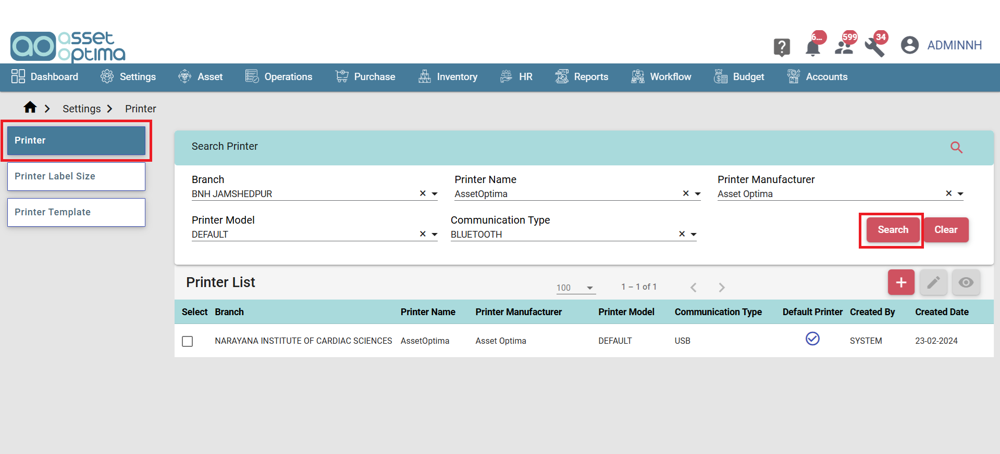
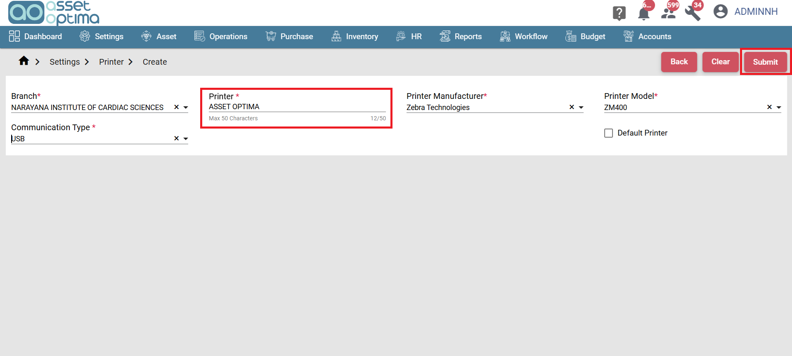
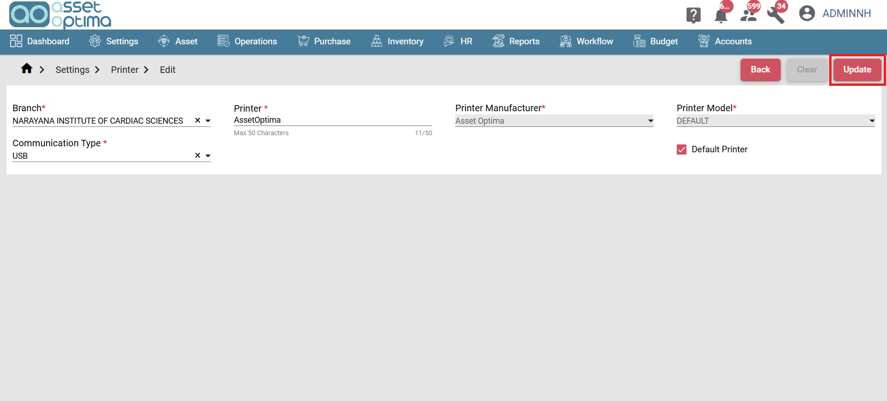
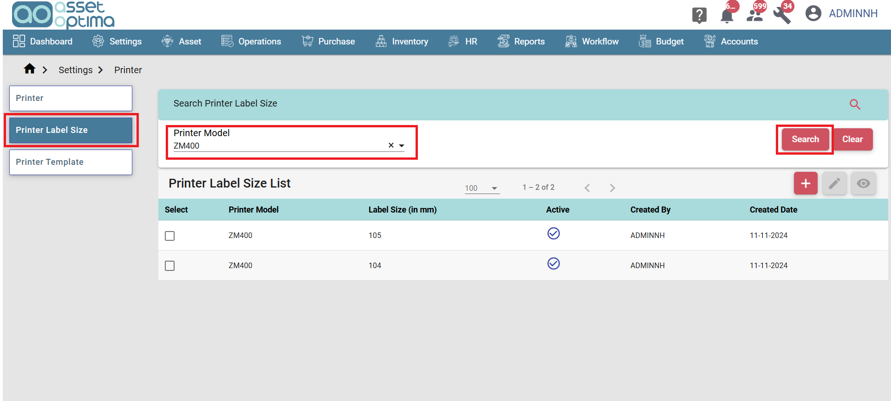
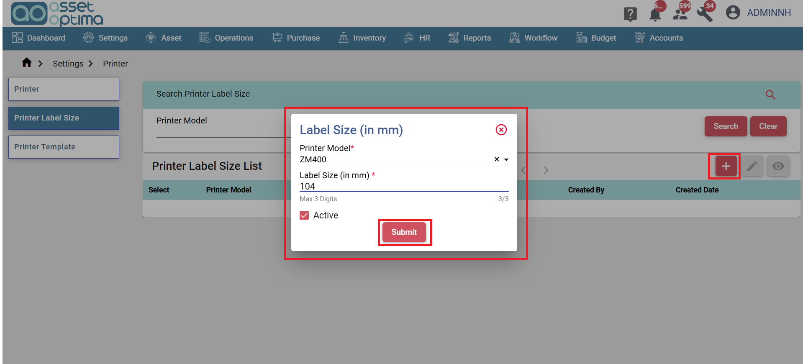
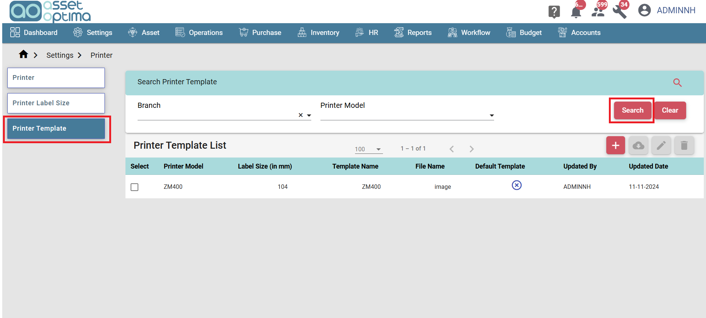
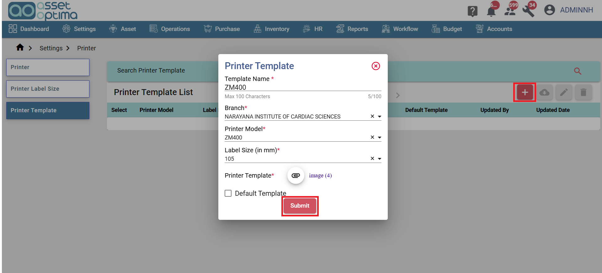
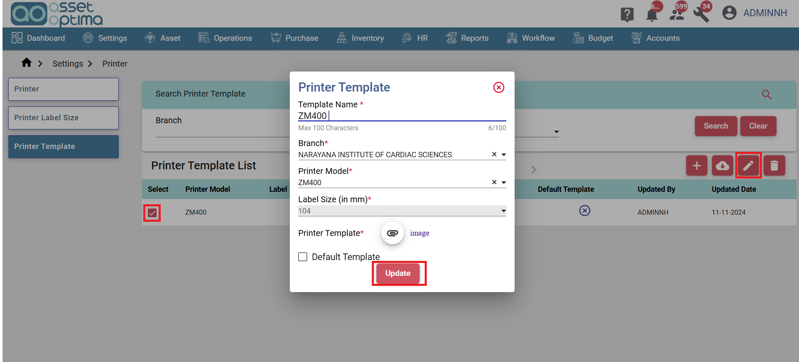

> The Printer Module in the application allows users to add printers designated for printing labels. This module provides options to customize label sizes and templates, enabling users to tailor labels according to specific requirements..

- Printer List:
  - In the Printer screen, use the Printer Search field to quickly find specific Printer records.

- Printer Create:
  - To add the Printer, click the "Create" button, complete the relevant fields and click the Submit button to save the record.

- Printer edit screen:
  - To edit the Printer, select the corresponding checkbox and click the edit button to edit.
  - Click the update to save the changes.
  - Click the view button to see the record info.

- Printer Label Size:

- Printer Label Size List:
  - In the Printer Label Size screen, use the Printer Label Size Search field to quickly find specific Printer Label Size records.

- Printer Label Size Create:
  - To add the Printer Label Size, click the "Create" button, complete the relevant fields and click the Submit button to save the record.

- Printer Label Size edit screen:
  - To edit the Printer Label Siz, select the corresponding checkbox and click the edit button to edit.
  - Click the update to save the changes.
  - Click the view button to see the record info.

- Printer Template:

- Printer Template List:
  - In the Printer Template screen, use the Printer Template Search field to quickly find specific Printer Template records.

- Printer Template Create:
  - To add the Printer Template, click the "Create" button, complete the relevant fields and click the Submit button to save the record.

- Printer Template edit screen:
  - To edit the Printer Template, select the corresponding checkbox and click the edit button to edit.
  - Click the update to save the changes.
  - Click the view button to see the record info.

