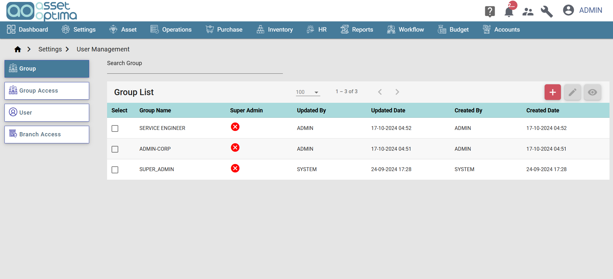
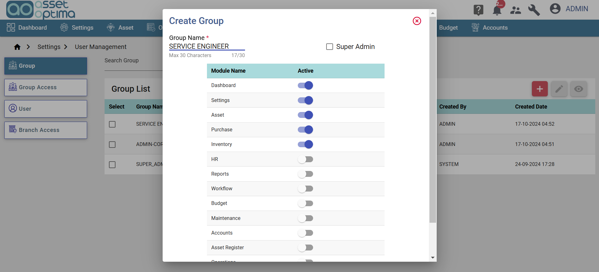
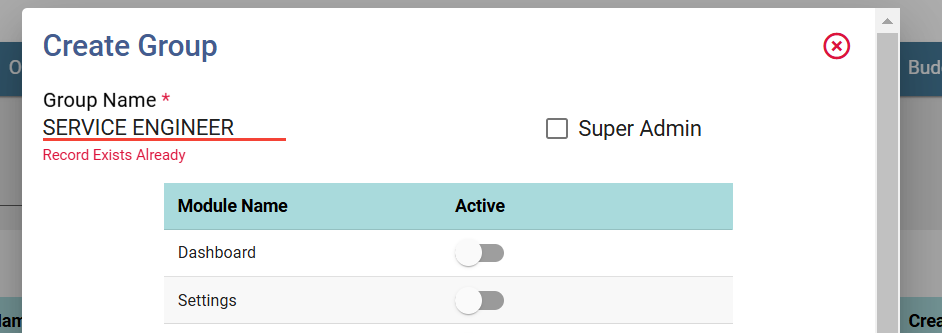
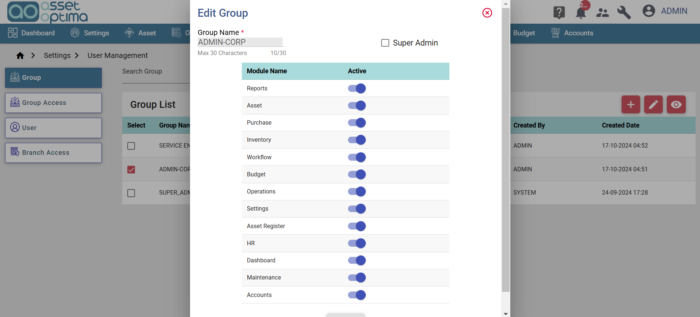
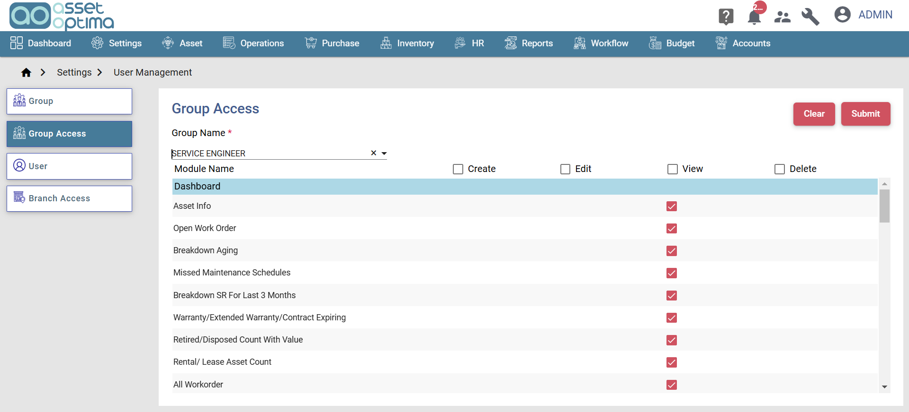
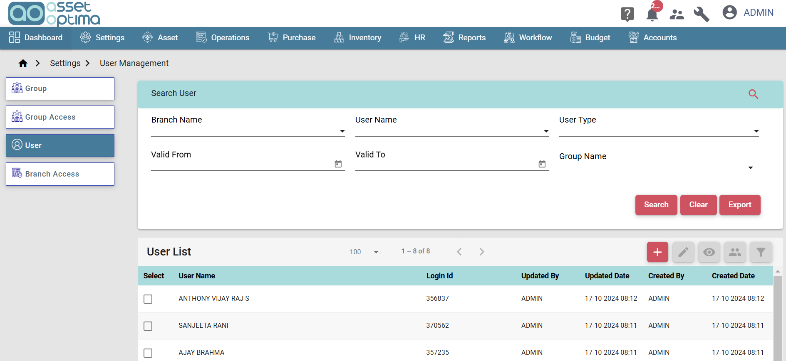
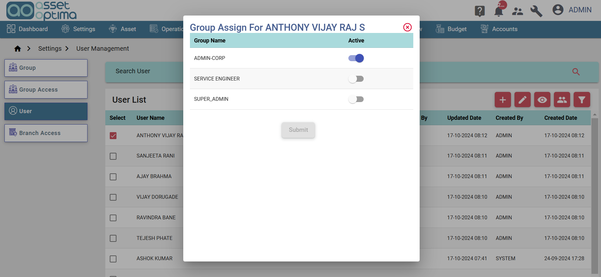
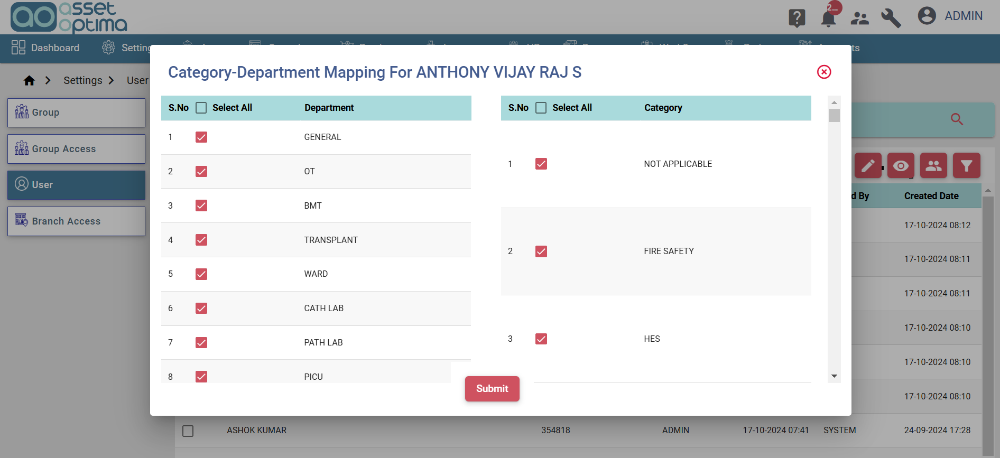
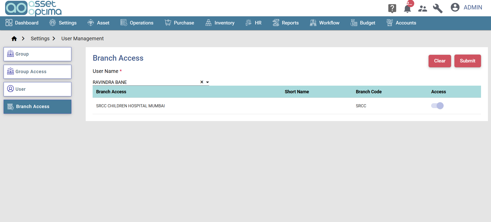

## Introduction
>- This module is to control the access to the application. Based on the access given all other modules/menus will be displayed.
>- In this module user can create different users and can restrict the access to different menus and modules.
>- Navigation: Settings --> User Management

### Group
- This module is to create different group, for each group user can restrict the menu access.
- the below figure shows the registered list of groups.

- User can create new group by clicking on create button(top right corner).
- User can also search for particular group by group name.
- The create group pop up as shown below.

- The group name must be unique, if the user enters already existing group name then 'Record Already exist' error will be displayed as shown in below figure and submit button will be disabled.

- All the menu names will be displayed followed by active toggle button, user can control access to menus by toggling the button.
- User can modify the menu access for particular group at any point od time by clicking edit icon in the grid.
- Clicking on edit icon opens pop up as shown below.

### Group Access
> This module is to define module access  for particular group.

- User have to select the group name, once the group name is selected all modules name under selected menu for the group will be displayed as shown in below picturer.

- For each module name 4 options will be provided- create,edit,view and delete.
- Based on the access given in this module user will be able perform the create, edit, delete and view operation.
- User can select all the modules by clicking on check boxes on the top(right next to module name).

### User
> This module is to create different users of this software of an organization.

- The list of registered users will be displayed as shown below.

- One can search for particular user based on different conditions as shown in above figure.
- User can generate an detailed excel report by clicking on export button.
- The four icons in action column of the grid indicates the following features respectively,
  * View: User can view detailed information about particular user by clicking on this icon.
  * Edit: User can edit details of particular user by clicking on this icon.
  * Clicking on edit/view icon redirect to create user page.
  * Group Access: this shows the particular users group, clicking on this icon opens pop up as shown below.
    * one user can be assigned to multiple one group.

   

  * Category Department access: This represents the access to particular department and category, if for particular department/category access is not given then data related to those department/category will not be displayed for the  user. Clicking on this icon opens as pop up as shown below.
   * In this pop up all the registered department and category names will be displayed.

  

### Branch access
> - This module is to control the access to different branch of an organization.
> - If the access is not given for particular branch then the toggle button will be disabled for the branch. 

  
