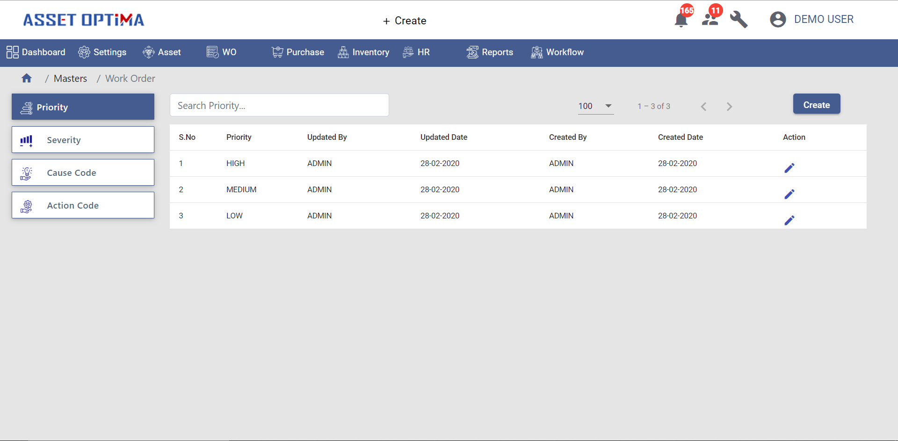
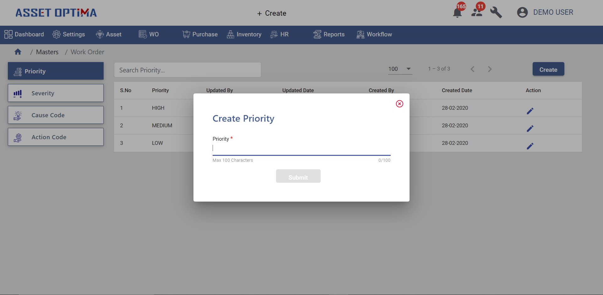
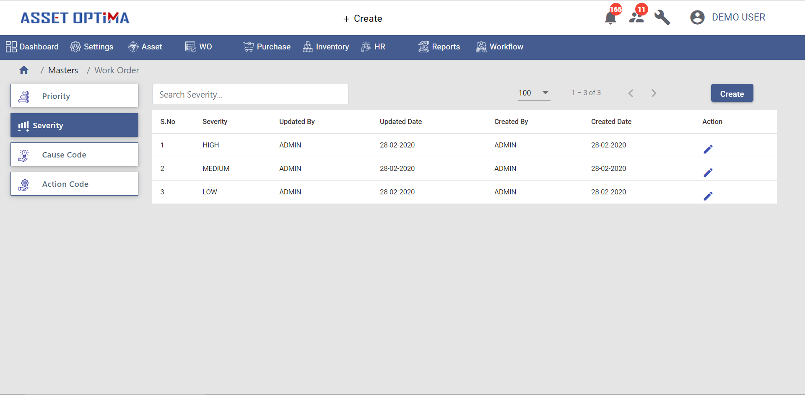
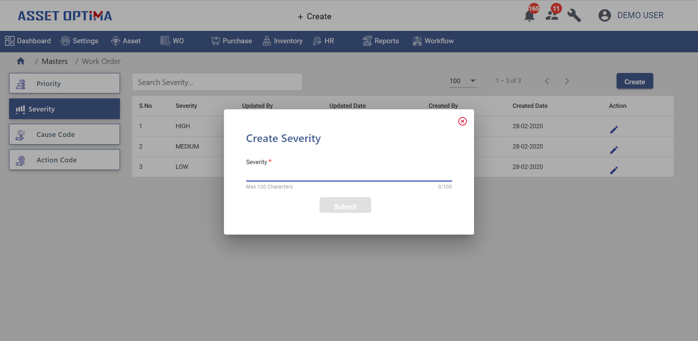
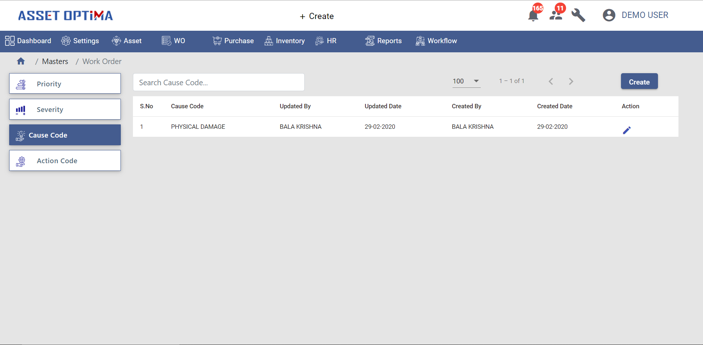
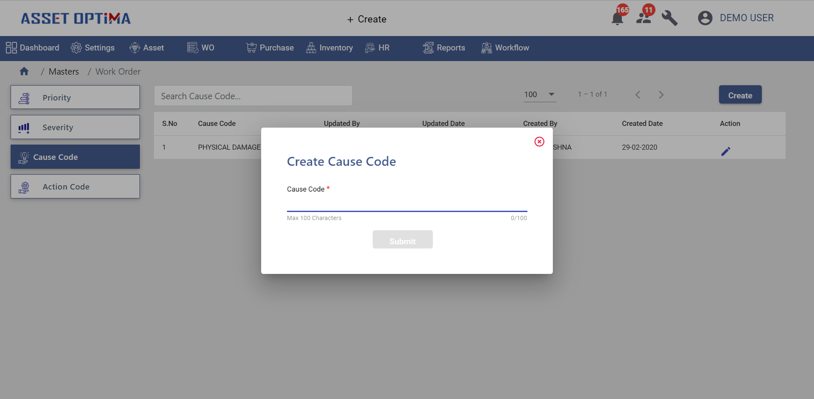
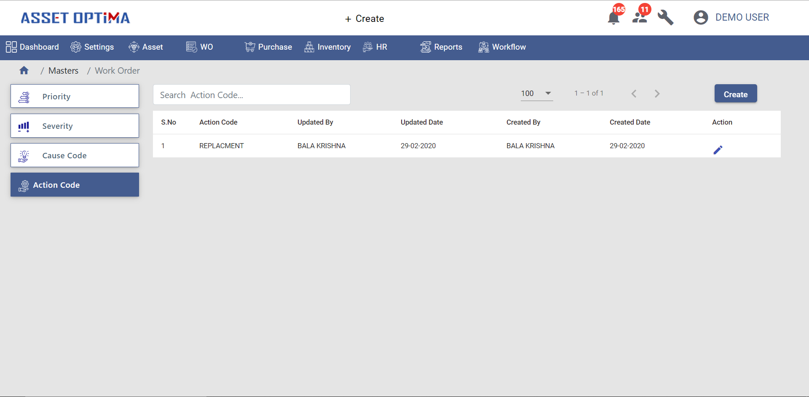
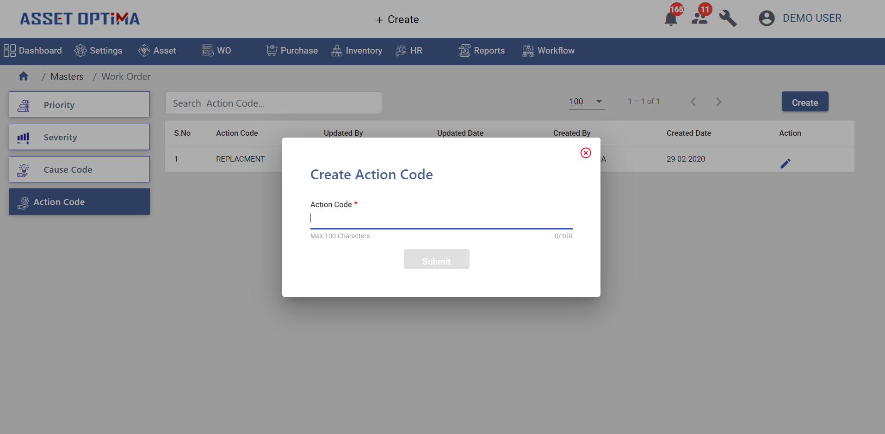

## Introduction 
> This is to create some pre defined set of different levels of priority, severity, possible cause code for breakdown and its possible actions.

### Priority
> - This module is to create different levels of priority.The list of created priorities will be as shown below.

 - Each work order needs to attach to any one of the priority level, and based on priority level work orders can be proceeded further.
 - User can search for particular priority level(search field on top of grid).
 - User can edit any record by clicking on edit icon in the grid.

- User can also create new priority type by clicking on create button(top right corner).
- Upon clicking create button opens a pop up as shown below

- Submit button enables once we enter priority name.

### Severity
>- This module is to create different types of severity, based on asset functionality and place where it is used different severity types can be defined.

- Each work order needs to map to any one severity type.
- List of created severity levels will be displayed as shown in the picture.
- User can search for particular severity type bt severity name(search field on top of grid).
- User can also edit particular record by clicking on edit icon.

- User can create severity type by clicking on create button(right top corner).
- The below picture shows the severity create pop up.

- Submit button will be enabled upon entering severity name, once submit button is clicked the record will be saved and displayed in grid.

### Cause Code
> This module is to register possible cause for asset breakdown.

- List of registered cause codes will be displayed as shown below.
- User can edit any particular cause code by clicking on edit icon.
- User can search for particular cause code(search field on top of grid).

- User can create new cause code by clicking on create button(top right corner), which opens a pop up as shown below.

- Submit button will be enabled once user enters cause code.

### Action Code
> This module is to define the possible actions that can be taken when breakdown occurred.

- List of registered action code will be displayed as shown  in below picture.
- User can search for particular action code(search field on top of grid).
- User can edit any record by clicking on edit icon in the grid.

- User can create new action code by clicking on create button(top right corner).
- The below figure shows the create action code pop up.

- Submit button will be enabled only after entering action code, Clicking on submit button save the record and added record will be displayed in the grid.

