## Work Order
> This module list downs all the work orders.

- User can search for particular work order based on different criteria  as shown in the below picture.

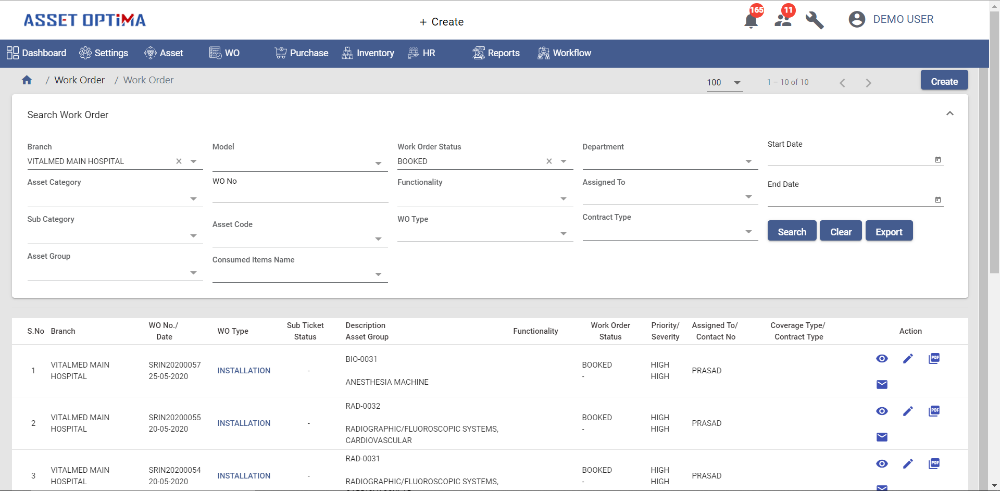

- By default the table displays all the booked work orders of login users branch.
- Button Functionality:
  * Create: navigate to new window to create a work order.
  * Search: Load the tables data as per search criteria.
  * Clear: Clears all the search field(except branch and work order status), refresh the table data.
- Icons Description:(grid action column)
  * View: User can view the complete details about the work order.
  * Edit: User can update the record.
  * PDF: Generates PDF report of selected work order, if the work order type is 'INSTALLATION' then this will generates installation report. 
   - Other than installation work order clicking on PDF icon open a following pop up

   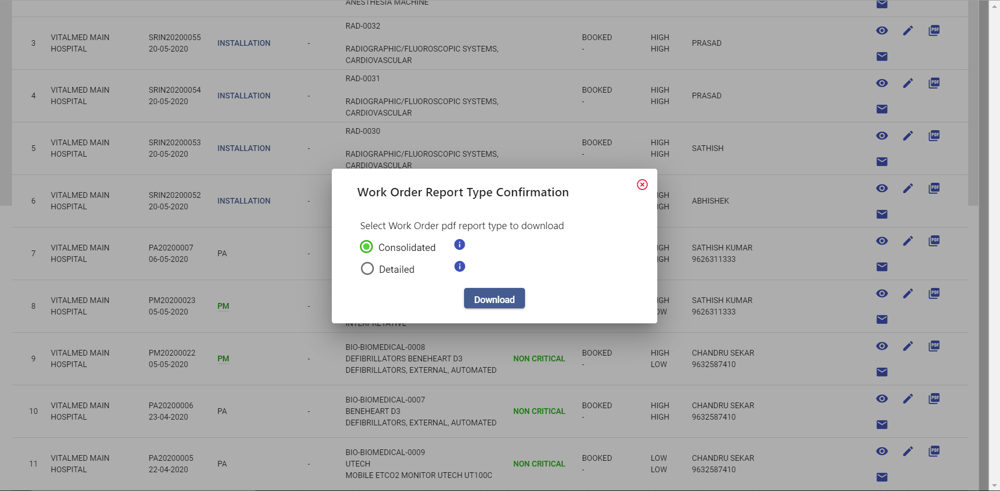
   
     * Consolidated: This report contains probably single page report which contains information about asset,wor order, contract, spares and service.
     * Detailed: This report contains complete information of work order.
     (The icon next to the consolidated/detailed shows the detailed information about report types)
  * Email: To send email to particular recipient, clicking on email icon open following pop up

  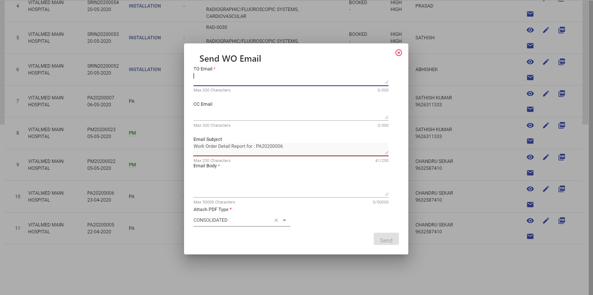 

  * User can send email to any mail address, the work order details will be captured in attached PDF. User can select either consolidated report or detailed report.

  ###### How to create work order 
  * User can create work order by clicking on create button which will navigate to following page as shown below.
  * Upon creation of each work order the notification will be sent to particular asset's 'DEFAULT SR NOTIFY USER' person, if non of the employees were assigned as 'DEFAULT SR NOTIFY USER' then the notification sent to branch's 'DEFAULT SR NOTIFY PERSON'(This information will be collected during registration of a branch).
  * Upon each status change of a work order the end user(Caller) will be notified with sms.  

  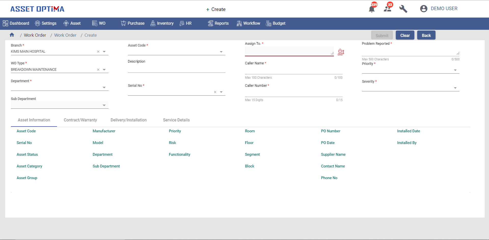
  
  * Field description:
    * Branch: Branch name(by default set to login user branch name).
    * Wo Type: Type of the work order, by default breakdown will be selected. Work order types need to be defined while installing the software, pre defined work order types are 
        1. Asset Installation
        2. Breakdown Maintenance
        3. Preventive Assurance
        4. Preventive maintenance
        5. Quality Assurance
        6. Request for Stock
    * Department: Department of selected asset.
    * Sub Department: Sub department of an selected asset.
    * Asset code: List down all the assets(only the assets with status 'IN-USE').
    * Description: Description of an selected asset.
    * Serial No: Serial number of an selected asset.
    * Assign To(Click on the icon): This is to assign the work order to particular employee. Clicking on this icon opens the following popup(Select the asset code before clicking on assign to icon).

    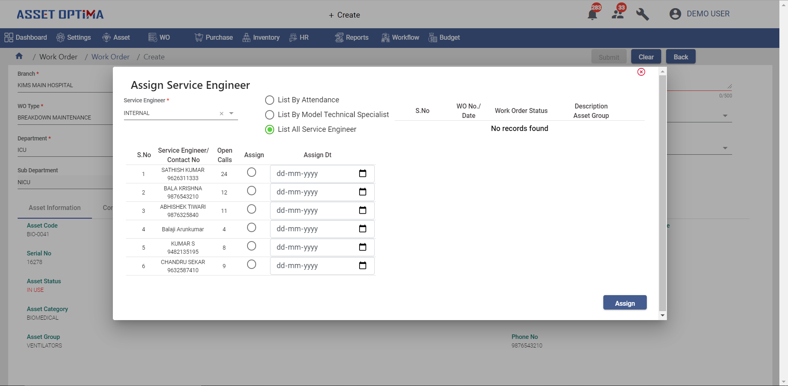
     
    * Field Description:
      * Service Engineer: User can select either internal engineer or external engineer for any work order service.
      * List By Attendance: Clicking upon this radio button list downs the engineers name.
      * List By Model Technical specialist: This list downs all the specialists name that are attached to selected assets model.
      * List of All Service Engineer: This list downs all the service engineers of the particular branch(Employees who are marked as service engineers while registering an employee).
      * Selecting any one service engineer name shows all the open work order that are already assigned to him. 
    * Caller Name: Name of the person who raises the work order.
    * Caller Number: Contact number of the person who raised work order.
    * Problem Reported: Specific reason for raising an work order,if the work order type is PA, PM or QA then this field will be auto filled.
    * Priority: This list downs all the registered priority types(Work order-->master-->priority).
    * Department: Department of selected asset.
    * Severity: This list downs all the severity types that are registered in master(Work order-->master-->severity).
    * Tabs:
      * Asset Information: Information about selected asset.
      * Contract/Warranty Details: Warranty or contract details of selected asset.
      * Delivery/Installation: Delivery/Installation information.
      * Service Details:List of all the previous work orders.
    * Buttons:
      * Submit: Enables upon entering mandatory fields, Clicking upon which saves the record and redirect to work order list screen.
      * Clear: Clears all the entered data fields.
      * Back: Redirect back to work order list screen.

  ##### Processing of an work order.
    
  * Clicking on edit icon in the work order list(work order status booked) screen redirects to following screen as shown below.
 
  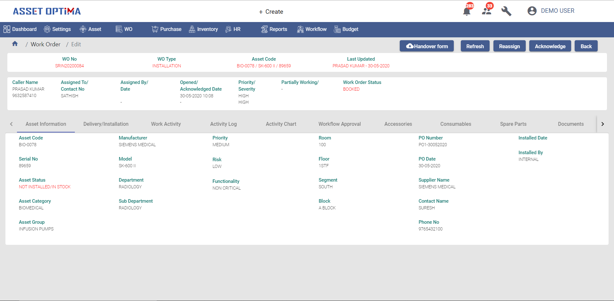 
 
Tab Description(Common for all type of work order):
 * Asset Information: Basic asset information.
 * Delivery/Installation: Gives the information about installation. 
 * Work activity: This list downs all the activities  done either by internal or external engineer. Clicking an add activity button opens the pop up as shown below
 
 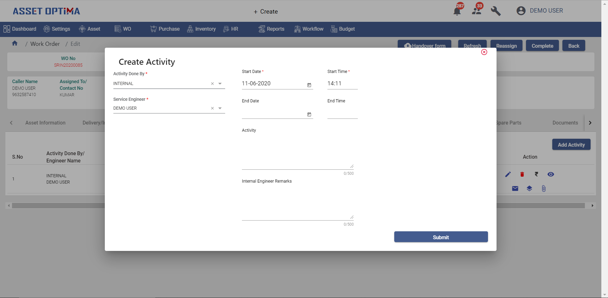
  
  * The end date and end time should be greater than start date and time.
   * Icon description(in work activity tab): 
    * Edit: To edit the added work activity.
    * Delete: To delete the activity.
    * External Service Cost: User can specify any external spare/labour cost. Clicking on this icon opens a popup as shown below

    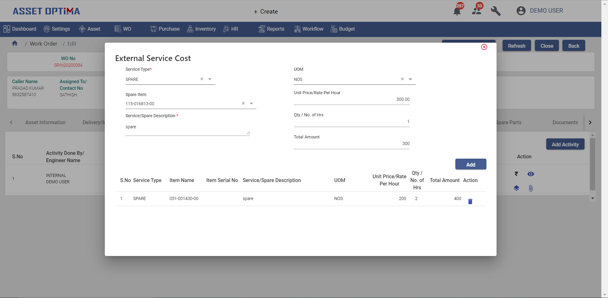
    * View: To view the added work activities.
    * Email: To send email to any mail address.
    * Use from stock: To add the item from stock to particular asset. Clicking on this icon redirect to stock create page.
    * Attach File: User can upload any related document for the particular activity, clicking on this icon open following popup
    (Once the work order status changes to completed-approval pending then edit, delete, email icons will not be displayed)

    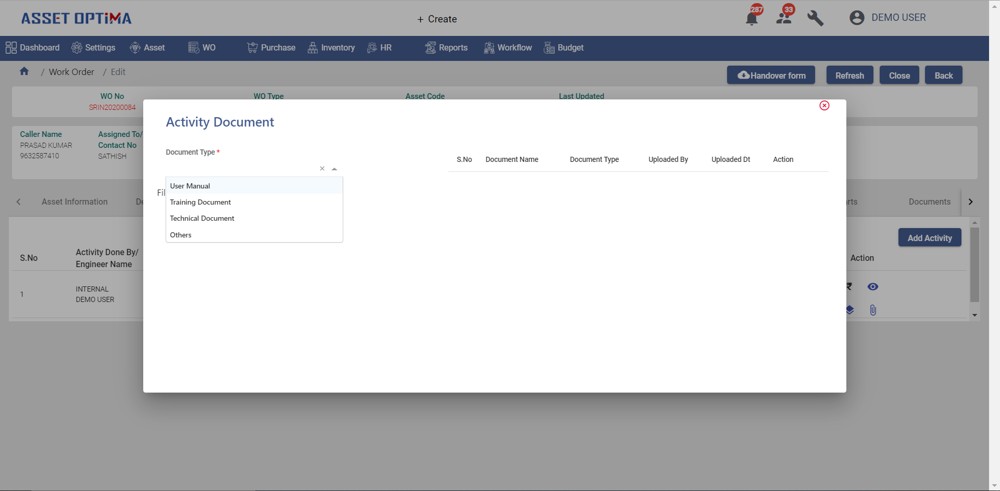

  * Activity Log: This tab describes all the different stages of an work order along with its turn around time. All the fields in this tab are auto captured.
  
  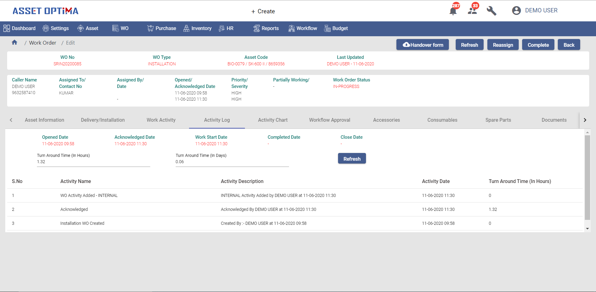
  * Activity Chart: List downs the different stages of work order along with date, User have a option to export these information in to excel report.

  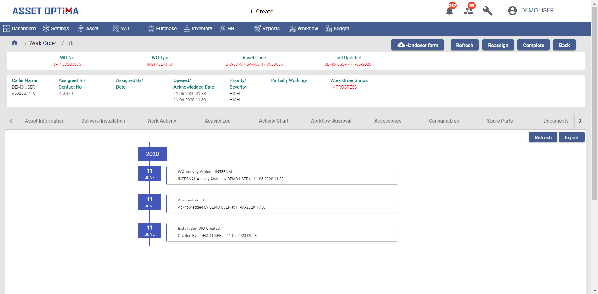
  * Workflow Approval: Upon the completion work order the this tab will displays the attached workflow as shown below. The approve button will be visible if the login employee has approval rights.

  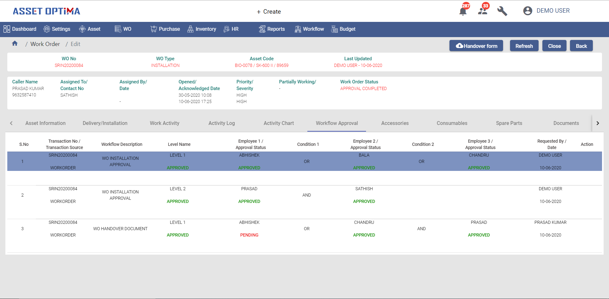
  * Accessories, Consumables, Spare parts: User can allocate any items from stock to particular asset.
  * Document: User can upload any related documents, user must upload installation report before completion of work order. Clicking on add button in this tab opens a following popup(User will be able add document only during 'IN-PROGRESS' state).
  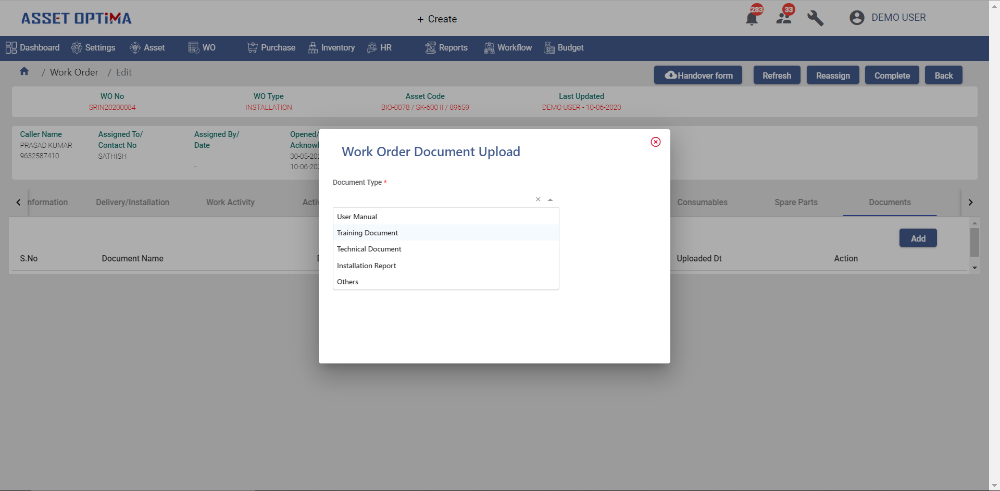

* Handover: To update handover information. Clicking on add button in the tab opens following pop up(the add button will be displayed only during work order status 'IN-PROGRESS').
  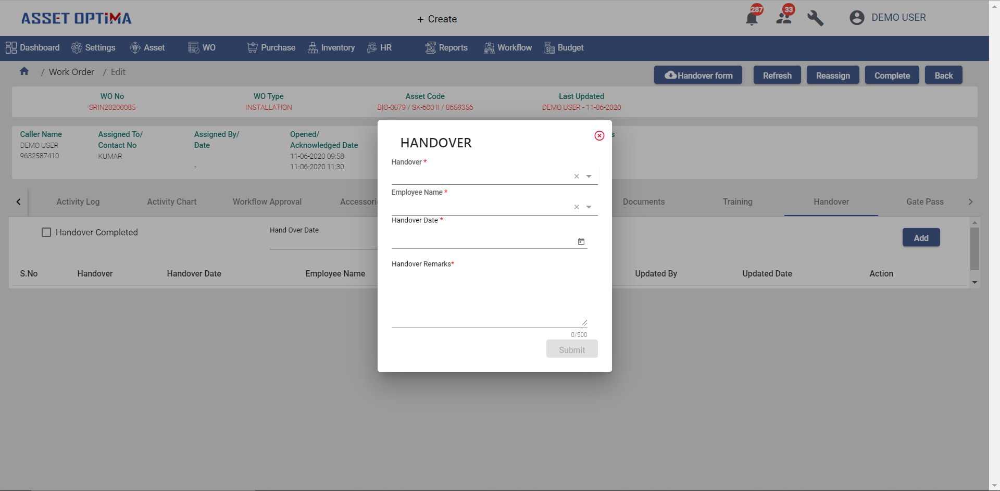
   * Field Description: 
    * Handover: Pre-defined handover types are 
       1. Accessories
       2. Consumables
       3. PM Kit
       4. User Manual
    * Employee Name: Name of the employee to whom handover item is given.
    * Handover Date: Date of handover.
    * Handover Remarks: Detailed remark.

  * The added information will be displayed in the grid.

  * GatePass: If any movement needed during the installation user can raise the gatePass. Clicking on generate gate pass button in the tab redirect to create gate pass page. Added gate pass details will be displayed in the grid.

  Button Description:
  * Handover Form: To download the handover form(Visible from work order status open to  complete).
  * Refresh: To refresh the page(Visible from  work order status open to close.
  * Back: Redirect back to work order list screen(Visible from work order status open to complete).
  * Reassign: To re assign the work order to any other employee, clicking on this opens popup as assign to icon(Work order create-->assign to)(Visible from work order status 'BOOKED' to till 'COMPLETED-APPROVAL PENDING').
  * Acknowledge: To acknowledge the work order, clicking on this button changes the work order status from 'BOOKED' to 'ACKNOWLEDGED'(visible only during work order status 'BOOKED').
  * Complete: Clicking on this button changes the work order status from 'IN-PROGRESS' to 'COMPLETED-APPROVAL PENDING'(Visible in work order status in-progress).
  * Re-open: To reopen the work order, clicking on this button changes the work order status from 'COMPLETED-APPROVAL PENDING' to 'IN-PROGRESS'(Visible during work order status 'COMPLETED-APPROVAL PENDING').

##### Installation Work Order:

* If the installation type is given as 'self-installation' for asset's asset group then upon approval of asset from inward, installation work order will be created by the system with status 'BOOKED'.
* User can also create installation work order.
* The flowchart describe the installation work order flow:
  
  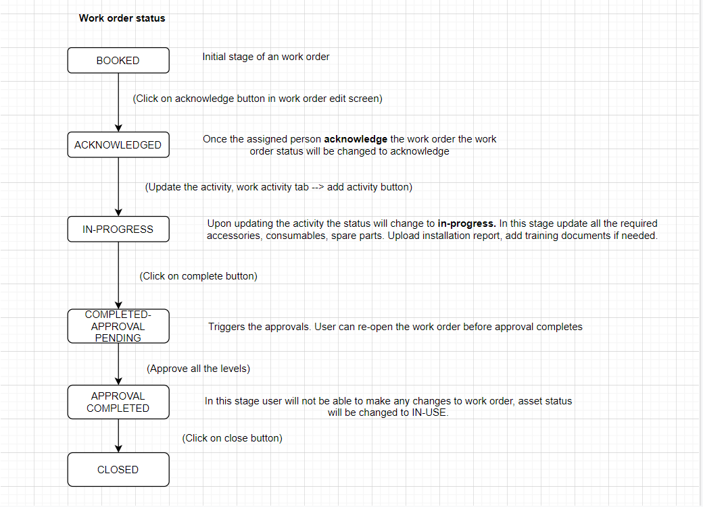

* Additional tabs along with common tabs:

* Training: If any training information is given to any employee for usage of the asset those information can be updated, Clicking on the add button in this tab open a following pop up(User can add training documents only during in-progress state).

  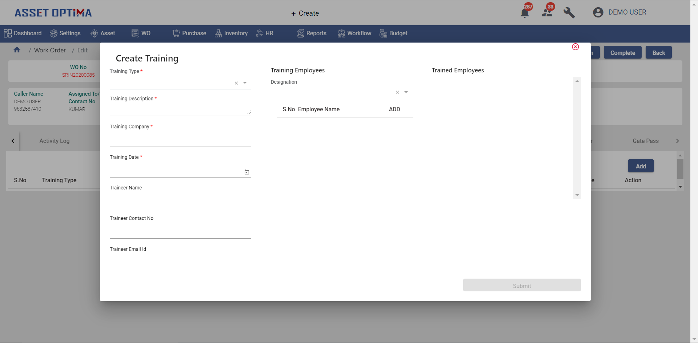
     * Field Description:
      * Training Type: Training type can be either clinical or technical.
      * Training Description: Detailed description of training.
      * Training Company: Training provided company name.
      * Training Date: Training provided date.
      * Trainer Name: Training provided person name.
      * Trainer Contact Number: Training provided person contact number.
      * Trainer Email Id: Training provided person email address.
      * Designation: Based on selected designation list of employee names displayed.
         Clicking on add icon in list of employee name adds the name to trained employee list. 
  * Added training details will be displayed in the grid.

##### Breakdown Work Order:

* When the break down work order is created the asset status changes to 'REPAIR'.
* The following flow chart describes the processing of an breakdown work order.

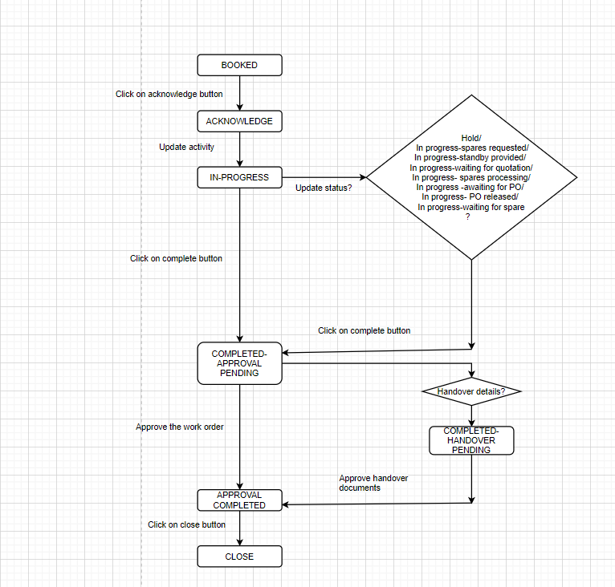

* Clicking on edit button in the work order grid(work order type BM,status in progress) redirect to following page.

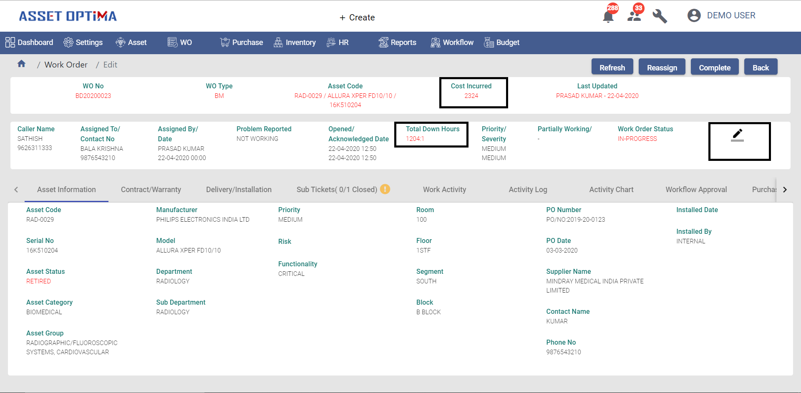

* Field Description(Highlighted):
 * Cost Incurred: Total cost incurred for the repair.
 * Total down hours: Total down time of an asset, calculated total time from work order status 'BOOKED' to till 'APPROVAL COMPLETED'.
 * Edit icon: Option to update work order status, priority and severity.

* Additional Tab Information:
* Contract/Warranty: This tab gives the information about the contract/warranty details of an asset as shown below.

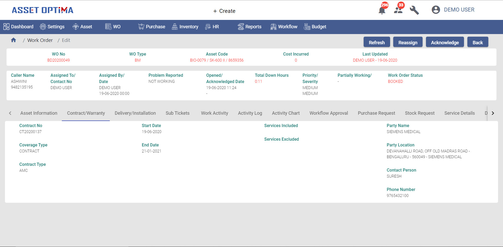
* Sub Tickets: User can raise sub ticket for the particular breakdown work order, The sub ticket processing is same as breakdown work order processing.
Clicking on the add button in this tab opens a following pop-up.

* Work activity: Once the BM work order is acknowledged before adding the activity actual reason for the breakdown needs to be updated. After the acknowledgement button will be enabled in work activity tab to update the actual reason. Clicking on 'Update Break Down Analysis' button opens the following pop up.

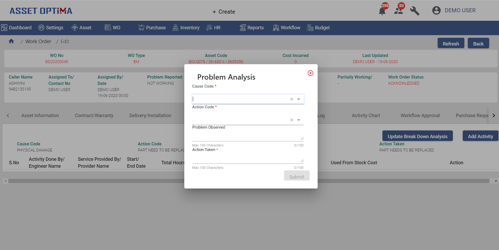
 
 * Field Description:
  * Cause Code: This field lists all the possible reason that are registered in cause code(work order-->master-->cause code).
  * Action Code: this field list down all the possible actions for breakdown that are registered in action code(work order-->master-->Action Code).
  * Problem Observed: The actual problem reported.
  * Action Taken: Action taken for the problem.

Once breakdown analysis is updated the add activity button will be displayed to add the activity. In this stage user have option to keep the work order in hold state as shown in below figure.

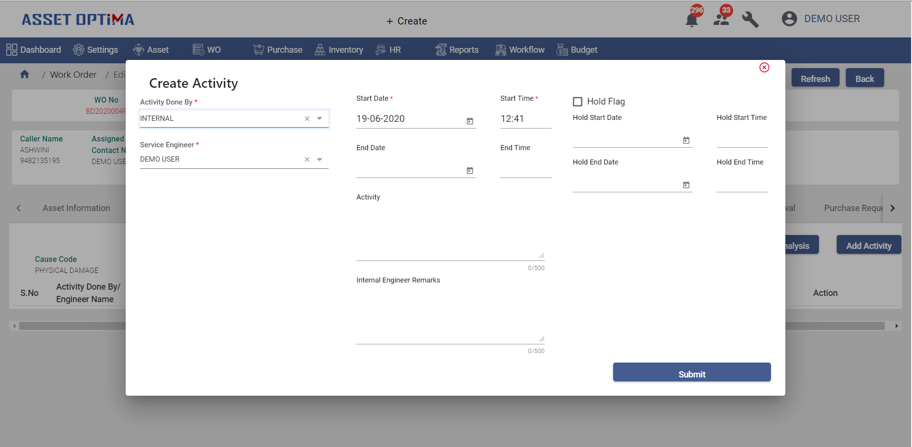

 

   

     